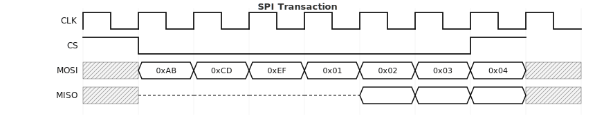
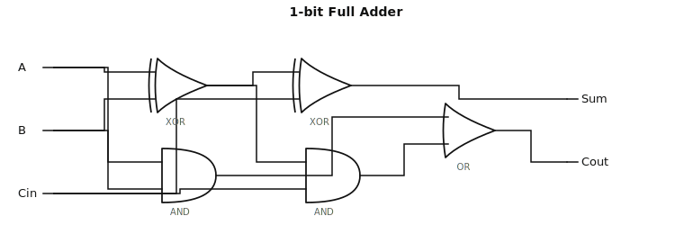
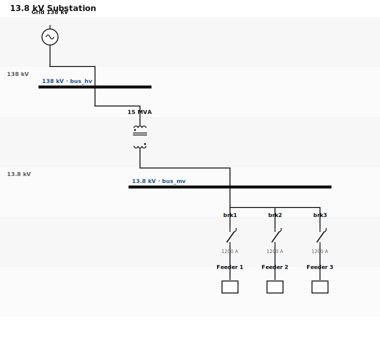
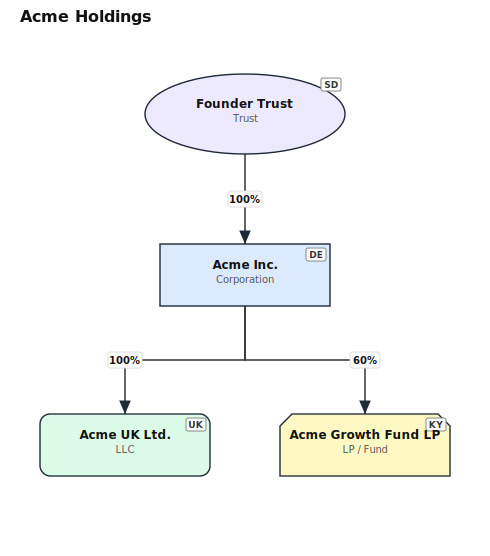
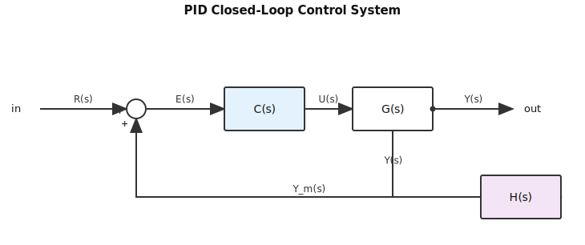

<p align="center">
  <strong>SchemaTex</strong><br>
  <em>Standards-as-code for professional diagrams.</em>
</p>

<p align="center">
  McGoldrick genograms · NSGC pedigrees · IEC 61131-3 ladder logic · IEEE 315 single-line diagrams · Newick phylogenetic trees · Moreno sociograms · and 7 more — all from a tiny text DSL, with zero runtime dependencies.
</p>

<p align="center">
  <a href="https://schematex.dev">Website</a> ·
  <a href="https://schematex.dev/playground">Playground</a> ·
  <a href="https://schematex.dev/docs">Docs</a> ·
  <a href="https://www.npmjs.com/package/schematex">npm</a>
</p>

<p align="center">
  <a href="https://www.npmjs.com/package/schematex"></a>
  <a href="https://bundlephobia.com/package/schematex"></a>
  
  
  <a href="./LICENSE"></a>
</p>

---

**SchemaTex** is the open-source rendering engine for diagrams that follow real industry standards. Thirteen diagram families across four domains:

- 👪 **Relationships** — genograms, ecomaps, pedigrees, sociograms, phylogenetic trees
- ⚡ **Electrical & Industrial** — ladder logic, single-line diagrams, circuit schematics, logic gates, timing, block diagrams
- 🏢 **Corporate & Legal** — entity structures, cap tables
- 🐟 **Causality & Analysis** — fishbone / Ishikawa

Mermaid draws generic flowcharts. SchemaTex draws the diagrams your domain experts actually sign off on — a genogram a genetic counselor accepts clinically, ladder logic that maps 1:1 to IEC 61131-3, a cap table that survives a Series A review.

⚡ **Zero runtime dependencies** · 📐 **10+ industry standards** · 🤖 **LLM-native DSL** · 🌱 **SSR-ready pure SVG**

## Install

```bash
npm install schematex
```

## Quick start

```ts
import { render } from 'schematex';

const svg = render(`
genogram "The Smiths"
  john [male, 1950]
  mary [female, 1952]
  john -- mary
    alice [female, 1975, index]
    bob [male, 1978]
`);
```

The diagram type is inferred from the first keyword. Tree-shake by importing only what you need:

```ts
import { render } from 'schematex/genogram';
```

## Gallery

Thirteen diagram types, one unified pipeline. **Try any of these live at [schematex.dev/playground](https://schematex.dev/playground).**

### 👪 Genogram — *McGoldrick family-systems standard*

Multi-generation family trees for therapy, social work, and medicine. Gender-specific shapes, medical condition fills, emotional relationship lines, index-person markers.

```
genogram "The Potter Family"
  fleamont [male, 1909, 1979, deceased]
  euphemia [female, 1920, 1979, deceased]
  fleamont -- euphemia
    james [male, 1960, 1981, deceased]
  mr_evans [male, 1925, deceased]
  mrs_evans [female, 1928, deceased]
  mr_evans -- mrs_evans
    lily [female, 1960, 1981, deceased]
    petunia [female, 1958]
  james -- lily "m. 1978"
    harry [male, 1980, index]
  petunia -- vernon [male, 1951]
    dudley [male, 1980]
  harry -cutoff- petunia
  harry -hostile- dudley
  harry -close- lily
```


[Genogram syntax →](https://schematex.dev/docs/genogram)

---

### 🌐 Ecomap — *Hartman 1978 standard*

Family systems embedded in institutional, social, and cultural support networks. Radial layout, weighted connection strengths, directional energy flow.

```
ecomap "Nguyen Family Resettlement"
  center: family [label: "Nguyen Family"]
  resettlement [label: "IRC Office", category: government]
  school [label: "Lincoln Elementary", category: education]
  clinic [label: "Community Clinic", category: health]
  temple [label: "Vietnamese Temple", category: cultural]
  neighbors [label: "Sponsor Family", category: community]
  family === resettlement [label: "active case"]
  family === school
  clinic --> family [label: "vaccinations"]
  family === temple [label: "anchor"]
  neighbors === family [label: "housing host"]
```


[Ecomap syntax →](https://schematex.dev/docs/ecomap)

---

### 🧬 Pedigree — *Standardized human pedigree nomenclature*

Multi-generation genetic inheritance charts for clinical genetics. Affected / carrier / presymptomatic status fills, proband arrow, consanguinity.

```
pedigree "BRCA1 Family — Hereditary Breast/Ovarian Cancer"
  I-1 [male, unaffected]
  I-2 [female, affected, deceased]
  I-1 -- I-2
    II-1 [female, affected]
    II-3 [female, carrier]
  II-1 -- II-4 [male, unaffected]
    III-1 [female, affected, proband]
    III-3 [female, presymptomatic]
```


[Pedigree syntax →](https://schematex.dev/docs/pedigree)

---

### 🌿 Phylogenetic tree — *Newick + NHX*

Evolutionary trees with clade coloring, bootstrap support values, proportional branch lengths, and indent-based DSL alternative.

```
phylo "Bacterial Diversity"
  newick: "((((Ecoli:0.1,Salmonella:0.12):0.05[&&NHX:B=98],Vibrio:0.2):0.08,((Bacillus:0.15,Staph:0.18):0.06[&&NHX:B=92],Listeria:0.22):0.1):0.15,((Myco_tb:0.3,Myco_leprae:0.28):0.12[&&NHX:B=100],(Strepto:0.25,Lactobacillus:0.2):0.08):0.2);"
  clade Gamma = (Ecoli, Salmonella, Vibrio) [color: "#1E88E5", label: "γ-Proteobacteria"]
  clade Firmi = (Bacillus, Staph, Listeria) [color: "#E53935", label: "Firmicutes"]
  scale "substitutions/site"
```


[Phylo syntax →](https://schematex.dev/docs/phylo)

---

### 🕸 Sociogram — *Moreno sociometry*

Social network diagrams with mutual choices, rejections, and group coloring. Force-directed or hierarchical layout. Auto-detects stars, isolates, cliques.

```
sociogram "Playground Dynamics"
  config: layout = force-directed
  group boys [label: "Boys", color: "#42A5F5"]
    tom; jack; mike; leo
  group girls [label: "Girls", color: "#EF5350"]
    anna; beth; chloe; diana
  tom <-> jack
  mike -x> leo [label: "conflict"]
  anna <-> beth
  diana -.- tom
```


[Sociogram syntax →](https://schematex.dev/docs/sociogram)

---

### ⏱ Timing diagram — *WaveDrom-compatible*

Digital waveforms with clock pulses, bus segments, high-impedance, and group labels.

```
timing "SPI Transaction"
CLK:   pppppppp
CS_N:  10000001
MOSI:  x=======  data: ["0xAB","0xCD","0xEF","0x01","0x02","0x03","0x04","0x05"]
MISO:  zzzz====  data: ["","","","","0xFF","0x12","0x34","0x56"]
```



[Timing syntax →](https://schematex.dev/docs/timing)

---

### 🔌 Logic gate — *IEEE 91 & IEC 60617*

Combinational and sequential logic with automatic DAG layout and Manhattan wiring.

```
logic "1-bit Full Adder"
input A, B, Cin
output Sum, Cout
s1 = XOR(A, B)
Sum = XOR(s1, Cin)
c1 = AND(A, B)
c2 = AND(s1, Cin)
Cout = OR(c1, c2)
```



[Logic gate syntax →](https://schematex.dev/docs/logic)

---

### ⚡ Circuit schematic — *SPICE-style netlist or positional DSL*

Analog/digital circuits with auto-routed power/ground rails and orthogonal signal wiring.

```
circuit "CE Amp (netlist)" netlist
V1 vcc 0 9V
Rc vcc c 2.2k
Rb vcc b 100k
Q1 c b e npn
Re e 0 1k
```


[Circuit syntax →](https://schematex.dev/docs/circuit)

---

### 🪜 Ladder logic — *IEC 61131-3 / Allen-Bradley*

Industrial PLC programs with tag+address+description labels, parallel branches, and Set/Reset coil pairs.

```
ladder "System Mode Selection"
rung 1 "Set Auto, reset Manual":
  XIC(AUTO_HMIPB, "BIT 5.10", name="Auto Mode HMI Pushbutton")
  XIO(MANL_HMIPB, "BIT 5.11", name="Manual Mode HMI Pushbutton")
  XIO(SYS_FAULT, "BIT 3.0", name="System Fault")
  parallel:
    branch: OTL(SYS_AUTO, "BIT 3.1", name="System Auto Mode")
    branch: OTU(SYS_MANUAL, "BIT 3.2", name="System Manual Mode")
```


[Ladder syntax →](https://schematex.dev/docs/ladder)

---

### ⚡ Single-line diagram — *IEEE 315 power one-line*

Substation and distribution one-line diagrams with transformers, breakers, buses, and protective relays.

```
sld "13.8 kV Substation"
utility [label: "Grid 138 kV"]
xfmr1 [type: transformer, kva: 15000, primary: 138, secondary: 13.8]
bus_hv [type: bus, voltage: 138]
bus_mv [type: bus, voltage: 13.8]
brk1 [type: breaker, amps: 1200]
utility -> bus_hv
bus_hv -> xfmr1 -> bus_mv
bus_mv -> brk1
```



[SLD syntax →](https://schematex.dev/docs/sld)

---

### 🏢 Entity structure — *cap tables & corporate ownership*

Corporate parent/subsidiary structures with ownership percentages, jurisdiction clustering, and entity type shapes (C-corp, LLC, trust, fund).

```
entity "Acme Holdings"
  acme_inc [type: corp, jurisdiction: DE]
  acme_uk [type: ltd, jurisdiction: UK]
  acme_fund [type: fund, jurisdiction: KY]
  trust_a [type: trust, jurisdiction: SD]
  trust_a --100%--> acme_inc
  acme_inc --100%--> acme_uk
  acme_inc --60%--> acme_fund
```



[Entity syntax →](https://schematex.dev/docs/entity)

---

### 📦 Block diagram

Signal-flow block diagrams with summing junctions, gain blocks, and feedback loops.

```
block "PID Loop"
  ref [type: sum, label: "+"]
  err [type: gain, label: "Kp"]
  plant [label: "Plant"]
  sensor [label: "Sensor"]
  ref -> err -> plant -> sensor
  sensor ->> ref [label: "−"]
```



[Block syntax →](https://schematex.dev/docs/block)

---

### 🐟 Fishbone — *Ishikawa cause-and-effect*

Cause-and-effect diagrams with auto-categorized branches and alternating rib layout.

```
fishbone "Late Software Delivery"
effect "Project Delayed"
category people "People"
category process "Process"
category tools "Tools"
category env "Environment"
people : "Skill gaps" : "Unclear roles"
process : "Missing specs" : "Scope creep" : "No retrospectives"
tools : "Outdated IDE" : "Flaky CI"
env : "Remote timezone lag" : "Legacy codebase"
```


[Fishbone syntax →](https://schematex.dev/docs/fishbone)

## Why SchemaTex?

**Generic flowchart tools can't draw professional diagrams.** Every diagram domain has published standards — symbol conventions, layout rules, labelling grammars — and when you ignore them, domain experts reject the output:

- **Genograms** follow the [McGoldrick (2020)](https://en.wikipedia.org/wiki/Genogram) standard — gender-specific shapes, medical condition fill patterns, emotional-relationship line styles, generation-based layout. A circle-labeled-as-female in a flowchart is not a genogram.
- **Ladder logic** follows [IEC 61131-3](https://en.wikipedia.org/wiki/IEC_61131-3) with Allen-Bradley tag conventions — three-line labels (tag/address/description), Set/Reset coils, input-side seal-in, parallel rungs.
- **Single-line diagrams** follow [IEEE 315](https://standards.ieee.org/ieee/315/5052/) — protective device clustering, voltage-tier hierarchy, transformer symbology.
- **Pedigrees** follow NSGC human-pedigree nomenclature; **phylogenetic trees** roundtrip Newick + NHX; **cap tables** compute tier-aware ownership rollup.

SchemaTex treats each standard as a first-class citizen with its own parser, layout algorithm, and SVG renderer — **standards-as-code**, not generic shapes with domain labels.

No existing open-source library covers this spread. GoJS has isolated samples but costs **$7k+/seat**. Schemdraw is Python-only. draw.io is a heavyweight GUI. Everything else is proprietary or abandoned.

### Designed for LLM code generation

SchemaTex DSLs are small, consistent, and shaped by what LLMs get wrong:

- Each diagram type has a minimal, documented grammar an LLM can learn from a single example.
- Error messages are AI-readable — line number plus specific fix suggestion, not `Parse error at line 42`.
- Syntax avoids the common LLM failure modes (CJK quoting, ambiguous nesting, positional vs. named args).

Written by humans, shaped by what LLMs get wrong.

## Features

- **Zero runtime dependencies.** No D3, no dagre, no parser generators. Hand-written parsers and layout engines. Self-contained TypeScript.
- **Standards-compliant output.** Each diagram type implements a published specification, not our own invention.
- **Semantic SVG.** Every element has accessible `<title>` / `<desc>`, CSS classes for theming, and `data-*` attributes for interactivity. No inline styles.
- **Tree-shakable plugin architecture.** Each diagram is an independent plugin with its own parser, layout, and renderer. `schematex/genogram` → ~30 KB.
- **SSR-ready.** Pure string output, no DOM required. Works in Node, edge runtimes, and browsers.
- **TypeScript strict.** No `any`, no un-typed escape hatches.

## API

```ts
// Universal entry — dispatches by first keyword
import { render, parse } from 'schematex';

render(text: string, config?: SchematexConfig): string;
parse(text: string, config?: SchematexConfig): AST;

// Per-diagram (tree-shakable)
import { render as renderGenogram } from 'schematex/genogram';
import { render as renderLadder } from 'schematex/ladder';
```

See the [API reference →](https://schematex.dev/docs/api).

## Ecosystem

- **React** — `@schematex/react` *(coming soon)*
- **Obsidian** — code-block renderer plugin *(coming soon)*
- **Markdown-it / remark** — diagram fence support *(coming soon)*
- **CLI** — `npx schematex input.txt > output.svg` *(coming soon)*

## Contributing

Contributions welcome. See [CONTRIBUTING.md](./CONTRIBUTING.md).

Adding a new diagram type follows a 5-file pattern (parser, symbols, layout, renderer, integration). Each type has a standards document in [`docs/reference/`](./docs/reference/).

```bash
npm install
npm run typecheck
npm run test
npm run build
```

## License

[AGPL-3.0](./LICENSE) for open-source use. For commercial use without AGPL obligations (embedding SchemaTex into proprietary or closed-source products), a commercial license is available — contact **victor@mymap.ai**.

<p align="center"><sub>Built by <a href="https://mymap.ai">MyMap.ai</a>.</sub></p>
