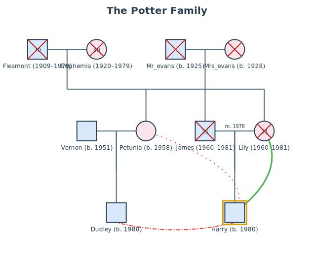
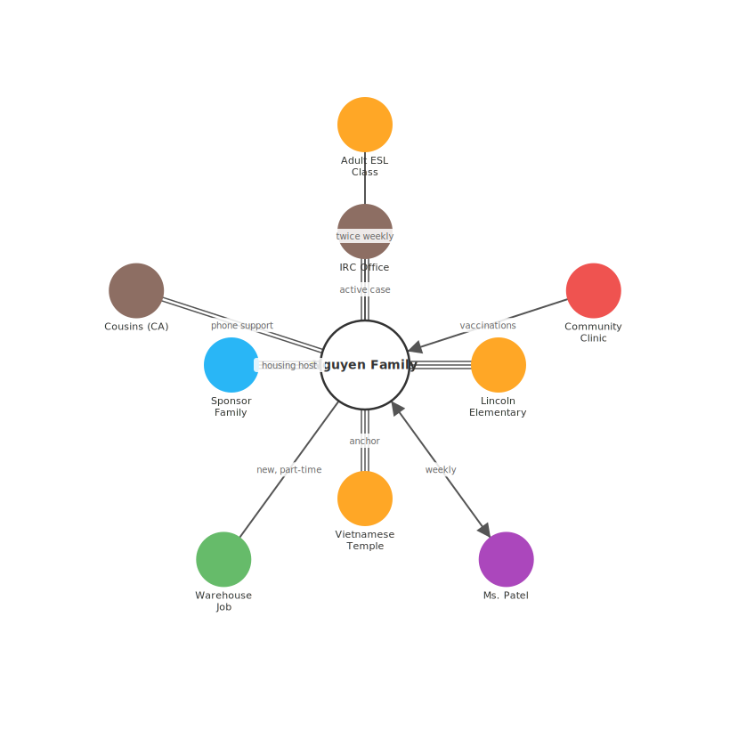
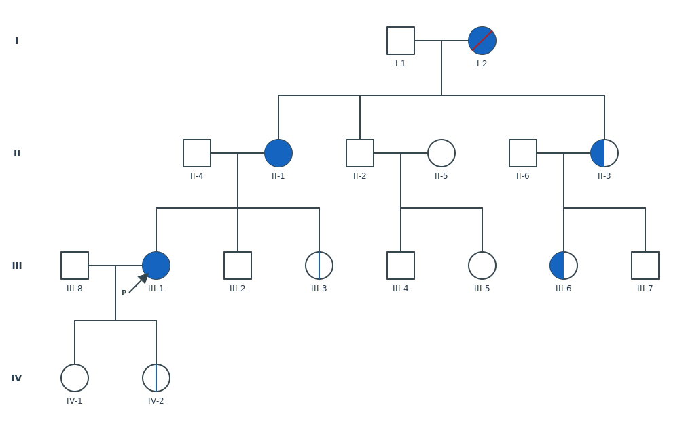
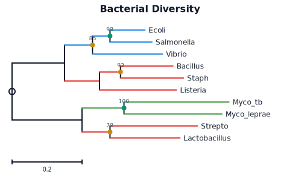
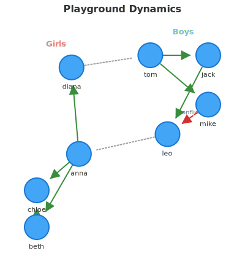
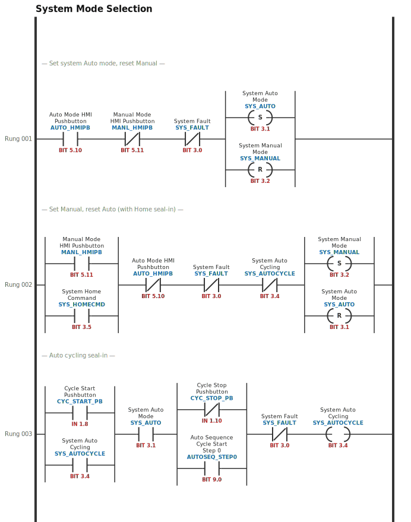
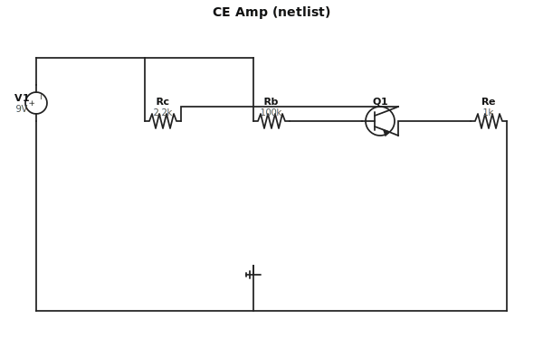

<p align="center">
  <strong>Lineage</strong><br>
  Text-to-SVG rendering for relationship diagrams and electrical engineering schematics.<br>
  <em>Like <a href="https://mermaid.js.org/">Mermaid</a> — but for genograms, pedigrees, ladder logic, and more.</em>
</p>

<p align="center">
  <a href="#gallery">Gallery</a> ·
  <a href="#install">Install</a> ·
  <a href="#quick-start">Quick Start</a> ·
  <a href="#genogram-syntax">Genogram</a> ·
  <a href="#ecomap-syntax">Ecomap</a> ·
  <a href="#pedigree-syntax">Pedigree</a> ·
  <a href="#phylogenetic-tree-syntax">Phylo</a> ·
  <a href="#sociogram-syntax">Sociogram</a> ·
  <a href="#timing-diagram-syntax">Timing</a> ·
  <a href="#logic-gate-diagram-syntax">Logic Gate</a> ·
  <a href="#ladder-logic-syntax">Ladder Logic</a> ·
  <a href="#circuit-schematic-syntax">Circuit</a> ·
  <a href="#api">API</a> ·
  <a href="#contributing">Contributing</a>
</p>

---

## What is Lineage?

Lineage turns plain text into standards-compliant SVG diagrams across two domains:

- **Relationship diagrams** — genograms, ecomaps, pedigree charts, phylogenetic trees, sociograms. Used daily in social work, family therapy, genetics, and medical practice.
- **Electrical / industrial diagrams** — timing waveforms, logic gate schematics, circuit schematics, block diagrams, and PLC ladder logic (IEC 61131-3 / Allen-Bradley).

All diagram types share the same pipeline (Text → Parser → AST → Layout → SVG) and zero runtime dependencies.

```
genogram "The Smiths"
  john [male, 1950]
  mary [female, 1952]
  john -- mary
    alice [female, 1975]
    bob [male, 1978, deceased]
```

```
ladder "Motor Start/Stop"
rung 1 "Seal-in circuit":
  parallel:
    branch:
      XIC(START_PB, name="Start Button")
    branch:
      XIC(MOTOR_AUX, name="Aux Contact")
  XIO(STOP_PB, name="Stop Button")
  OTE(MOTOR_CMD, name="Motor Command")
```

These produce standards-compliant diagrams with proper McGoldrick symbols, generation-based layout, and accessible SVG output — no dragging boxes around, no learning a visual editor.

### Why not Mermaid?

Mermaid is great for flowcharts and sequence diagrams. But **relationship diagrams** have domain-specific requirements that general-purpose tools can't meet:

- **Genograms** follow the [McGoldrick (2020) standard](https://en.wikipedia.org/wiki/Genogram) — gender-specific shapes (square/circle/diamond), medical condition fill patterns, standardized relationship lines, generation-based layout
- **Ecomaps** use radial layout with concentric rings, weighted connection types, and directional energy flow arrows ([Hartman 1978](https://en.wikipedia.org/wiki/Ecomap))
- **Pedigree charts** track genetic inheritance with carrier/affected status indicators

No existing open-source library handles these well. GoJS has a genogram sample but costs $7k+. Everything else is either proprietary or abandoned.

### Design principles

- **Zero runtime dependencies.** No D3, no dagre, no parser generators. Hand-written parsers and layout algorithms. The entire library is self-contained TypeScript.
- **Semantic SVG output.** Every element has accessible `<title>`/`<desc>`, CSS classes for theming, and `data-*` attributes for interactivity. No inline styles.
- **Plugin architecture.** Each diagram type (genogram, ecomap, pedigree) is an independent plugin with its own parser, layout engine, and renderer. Import only what you need.

## Gallery

### Genogram — Harry Potter Family

Multi-generation family with death years, relationship labels, index person, and emotional relationships.

```
genogram "The Potter Family"
  fleamont [male, 1909, 1979, deceased]
  euphemia [female, 1920, 1979, deceased]
  fleamont -- euphemia
    james [male, 1960, 1981, deceased]
  mr_evans [male, 1925, deceased]
  mrs_evans [female, 1928, deceased]
  mr_evans -- mrs_evans
    lily [female, 1960, 1981, deceased]
    petunia [female, 1958]
  james -- lily "m. 1978"
    harry [male, 1980, index]
  petunia -- vernon [male, 1951]
    dudley [male, 1980]
  harry -cutoff- petunia
  harry -hostile- dudley
  harry -close- lily
```

**Features shown:** birth/death year ranges (`1960–1981`), `index` person gold border, quoted relationship label (`m. 1978`), `deceased` status, and three emotional relationship types — `cutoff` (dashed blue), `hostile` (red), `close` (green).



---

### Ecomap — Refugee Family Resettlement

Family system embedded in institutional, social, and cultural support networks.

```
ecomap "Nguyen Family Resettlement"
  center: family [label: "Nguyen Family"]
  resettlement [label: "IRC Office", category: government]
  school [label: "Lincoln Elementary", category: education]
  esl [label: "Adult ESL Class", category: education]
  clinic [label: "Community Clinic", category: health]
  caseworker [label: "Ms. Patel", category: mental-health]
  temple [label: "Vietnamese Temple", category: cultural]
  neighbors [label: "Sponsor Family", category: community]
  employer [label: "Warehouse Job", category: work]
  cousins [label: "Cousins (CA)", category: family]
  family === resettlement [label: "active case"]
  family === school
  family --- esl [label: "twice weekly"]
  clinic --> family [label: "vaccinations"]
  caseworker <-> family [label: "weekly"]
  family === temple [label: "anchor"]
  neighbors === family [label: "housing host"]
  family --- employer [label: "new, part-time"]
  cousins == family [label: "phone support"]
```

**Features shown:** center node, 9 external systems with categories, mixed connection strengths (`===` / `==` / `---`), directional arrows (`-->`, `<->`), and labeled connections.



---

### Pedigree — Hereditary Breast & Ovarian Cancer (BRCA)

Four-generation family with multiple affected members, X-linked carrier status, and a proband.

```
pedigree "BRCA1 Family — Hereditary Breast/Ovarian Cancer"
  I-1 [male, unaffected]
  I-2 [female, affected, deceased]
  I-1 -- I-2
    II-1 [female, affected]
    II-2 [male, unaffected]
    II-3 [female, carrier]
  II-1 -- II-4 [male, unaffected]
    III-1 [female, affected, proband]
    III-2 [male, unaffected]
    III-3 [female, presymptomatic]
  II-2 -- II-5 [female, unaffected]
    III-4 [male, unaffected]
    III-5 [female, unaffected]
  II-3 -- II-6 [male, unaffected]
    III-6 [female, carrier]
    III-7 [male, unaffected]
  III-1 -- III-8 [male, unaffected]
    IV-1 [female, unaffected]
    IV-2 [female, presymptomatic]
```

**Features shown:** 4 generations with Roman numeral labels, `affected` / `carrier` / `presymptomatic` / `unaffected` status fills, `proband` arrow marker, `deceased` individual, and automatic sibling/spouse layout.



---

### Phylogenetic Tree — Bacterial Diversity

Ten-taxon tree with Newick input, clade coloring, and bootstrap support values.

```
phylo "Bacterial Diversity"
  newick: "((((Ecoli:0.1,Salmonella:0.12):0.05[&&NHX:B=98],Vibrio:0.2):0.08[&&NHX:B=85],((Bacillus:0.15,Staph:0.18):0.06[&&NHX:B=92],Listeria:0.22):0.1):0.15,((Myco_tb:0.3,Myco_leprae:0.28):0.12[&&NHX:B=100],(Strepto:0.25,Lactobacillus:0.2):0.08[&&NHX:B=78]):0.2);"

  clade Gamma = (Ecoli, Salmonella, Vibrio) [color: "#1E88E5", label: "γ-Proteobacteria"]
  clade Firmi = (Bacillus, Staph, Listeria, Strepto, Lactobacillus) [color: "#E53935", label: "Firmicutes"]
  clade Actino = (Myco_tb, Myco_leprae) [color: "#43A047", label: "Actinobacteria"]

  scale "substitutions/site"
```

**Features shown:** Standard Newick input with branch lengths, NHX bootstrap support values (colored dots: green ≥95, yellow ≥75), 3 clade-colored branch groups with labels, and proportional scale bar.



---

### Sociogram — Playground Dynamics

Social network diagram with groups, mutual choices, rejections, and neutral connections.

```
sociogram "Playground Dynamics"
  config: layout = force-directed
  config: coloring = group

  group boys [label: "Boys", color: "#42A5F5"]
    tom
    jack
    mike
    leo

  group girls [label: "Girls", color: "#EF5350"]
    anna
    beth
    chloe
    diana

  tom <-> jack
  tom -> mike
  jack -> leo
  mike -x> leo [label: "conflict"]
  anna <-> beth
  anna <-> chloe
  beth <-> chloe
  anna -> diana
  diana -.- tom
  leo -.- anna
```

**Features shown:** Force-directed layout, group coloring (Boys blue, Girls red), mutual choices (`<->`), rejection edge (`-x>`) with label, neutral connections (`-.-`), auto-detected roles (stars, isolates).



### Timing Diagram — SPI Transaction

Digital waveforms with clock, chip-select, data buses, and high-impedance states.

```
timing "SPI Transaction"
CLK:   pppppppp
CS_N:  10000001
MOSI:  x=======  data: ["0xAB","0xCD","0xEF","0x01","0x02","0x03","0x04","0x05"]
MISO:  zzzz====  data: ["","","","","0xFF","0x12","0x34","0x56"]
```

**Features shown:** clock pulses (`p`), bus segments with data labels (`=`), high-impedance state (`z`, dashed midline), unknown/tri-state (`x`, cross-hatch), active-low signal name (`~CS_N` renders with overline).

### Logic Gate Diagram — Full Adder

IEEE 91 ANSI distinctive shapes with DAG layout and Manhattan wiring.

```
logic "1-bit Full Adder"
input A, B, Cin
output Sum, Cout
s1 = XOR(A, B)
Sum = XOR(s1, Cin)
c1 = AND(A, B)
c2 = AND(s1, Cin)
Cout = OR(c1, c2)
```

**Features shown:** multi-level gate composition, fan-out wiring (signal `s1` feeds two gates), output labels on wire stubs, monochrome IEEE 91 style. Use `[style: iec]` for IEC 60617 rectangular symbols.

---

### Ladder Logic — System Mode Selection

Three-rung industrial PLC program with Allen-Bradley naming conventions: XIC/XIO contacts, Set/Reset coil pairs on output-side parallel branches, input-side seal-in, and nested serial parallel blocks.

```
ladder "System Mode Selection"

rung 1 "Set system Auto mode, reset Manual":
  XIC(AUTO_HMIPB, "BIT 5.10", name="Auto Mode HMI Pushbutton")
  XIO(MANL_HMIPB, "BIT 5.11", name="Manual Mode HMI Pushbutton")
  XIO(SYS_FAULT, "BIT 3.0", name="System Fault")
  parallel:
    branch:
      OTL(SYS_AUTO, "BIT 3.1", name="System Auto Mode")
    branch:
      OTU(SYS_MANUAL, "BIT 3.2", name="System Manual Mode")

rung 2 "Set Manual, reset Auto (with Home seal-in)":
  parallel:
    branch:
      XIC(MANL_HMIPB, "BIT 5.11", name="Manual Mode HMI Pushbutton")
    branch:
      XIC(SYS_HOMECMD, "BIT 3.5", name="System Home Command")
  XIO(AUTO_HMIPB, "BIT 5.10", name="Auto Mode HMI Pushbutton")
  XIO(SYS_FAULT, "BIT 3.0", name="System Fault")
  XIO(SYS_AUTOCYCLE, "BIT 3.4", name="System Auto Cycling")
  parallel:
    branch:
      OTL(SYS_MANUAL, "BIT 3.2", name="System Manual Mode")
    branch:
      OTU(SYS_AUTO, "BIT 3.1", name="System Auto Mode")

rung 3 "Auto cycling seal-in":
  parallel:
    branch:
      XIC(CYC_START_PB, "IN 1.8", name="Cycle Start Pushbutton")
    branch:
      XIC(SYS_AUTOCYCLE, "BIT 3.4", name="System Auto Cycling")
  XIC(SYS_AUTO, "BIT 3.1", name="System Auto Mode")
  parallel:
    branch:
      XIO(CYC_STOP_PB, "IN 1.10", name="Cycle Stop Pushbutton")
    branch:
      XIC(AUTOSEQ_STEP0, "BIT 9.0", name="Auto Sequence Cycle Start Step 0")
  XIO(SYS_FAULT, "BIT 3.0", name="System Fault")
  OTE(SYS_AUTOCYCLE, "BIT 3.4", name="System Auto Cycling")
```

**Features shown:** Allen-Bradley tag + BIT address + human-readable description (`name=`) rendered as three-line labels (black / blue / red). Set (`OTL`) and Reset (`OTU`) coils in a parallel block on the output side of rung 1 & 2 — matching how real PLC ladder programs latch mode bits. Input-side seal-in parallel (Home Command holding Manual state). Two serial parallel blocks on rung 3 for independent OR conditions.



### Circuit Schematic — NPN Common-Emitter Amplifier

SPICE-style netlist input with **automatic schematic layout** — no manual positioning. The parser builds a net graph, ranks components (power source + middle + ground), and routes orthogonal wires with a shared supply rail at top and ground rail at bottom.

```
circuit "CE Amp (netlist)" netlist
V1 vcc 0 9V
Rc vcc c 2.2k
Rb vcc b 100k
Q1 c b e npn
Re e 0 1k
```

**Features shown:** SPICE-subset grammar (`<id> <net1> <net2> [...] <value-or-model>`), auto-detected component types by prefix (V→source, R→resistor, Q→BJT), ground net aliases (`0` / `gnd` / `GND`), auto-synthesized ground symbol, shared `vcc` supply rail (top) and `GND` rail (bottom), single-L orthogonal routing for signal nets, NPN transistor with three pins (`c`/`b`/`e`) — all laid out without any coordinate hints from the author.



Circuit Schematic also supports a **positional DSL** (Schemdraw-style direction-chained layout) when you want fine-grained placement control — see the [syntax guide](#circuit-schematic-syntax).

---

## Install

```bash
npm install lineage
```

Works with any bundler (Vite, webpack, esbuild, Rollup) and Node.js. Ships as ESM + CJS with full TypeScript declarations.

## Quick Start

```ts
import { render } from 'lineage';

const svg = render(`
genogram
  john [male, 1950]
  mary [female, 1952]
  john -- mary
    alice [female, 1975]
    bob [male, 1978]
`);

document.getElementById('diagram').innerHTML = svg;
```

The `render()` function auto-detects the diagram type from the first line and returns a complete SVG string.

## Genogram Syntax

Genograms model family structure across generations — marriages, divorces, children, medical conditions, and life status.

### Individuals

```
genogram
  john [male, 1950]
  mary [female, 1952]
  child [unknown, 1980, deceased]
```

| Property | Effect |
|----------|--------|
| `male` | Square symbol |
| `female` | Circle symbol |
| `unknown` | Diamond symbol |
| `1950` | Birth year (shown as label) |
| `deceased` | X drawn through symbol |
| `stillbirth` | Smaller symbol with X |
| `conditions: X(fill)` | Medical condition overlay |

### Relationships

```
genogram
  a [male, 1950]
  b [female, 1952]
  a -- b              # married
    child [female, 1975]
  a -x- b             # divorced
  a -/- b             # separated
  a ~ b               # cohabitation
  a -o- b             # engaged
```

Children are indented under the couple line they belong to:

```
genogram
  dad [male, 1950]
  mom [female, 1952]
  dad -- mom
    son [male, 1975]
    daughter [female, 1978]
```

### Medical conditions

Conditions use standard genogram fill patterns:

```
genogram
  patient [male, 1960, conditions: heart-disease(full) + diabetes(half-left)]
```

Fill types: `full`, `half-left`, `half-right`, `half-top`, `half-bottom`, `striped`, `dotted`

### Multi-generation example

```
genogram "Three Generations"
  grandpa [male, 1930, deceased]
  grandma [female, 1932]
  grandpa -- grandma
    dad [male, 1955]
    aunt [female, 1958]
  dad -- mom [female, 1957]
    me [male, 1985]
    sister [female, 1988]
```

## Ecomap Syntax

Ecomaps visualize a person or family's relationships with external systems — work, healthcare, community, legal, and social connections.

### Structure

Every ecomap has a **center** (the individual or family) surrounded by **external systems**, connected by lines that show relationship strength and energy flow.

```
ecomap "Maria's Network"
  center: maria [female, age: 34]

  work [label: "Tech Company", category: work]
  church [label: "St. Mary's", category: religion]
  mother [label: "Mom", category: family]

  maria === mother
  maria --- church
  maria === work
```

### Connection types

| Operator | Type | Visual |
|----------|------|--------|
| `===` | Strong | Triple line |
| `==` | Moderate | Double line |
| `---` | Normal | Single line |
| `- -` | Weak | Dashed line |
| `~~~` | Stressful | Wavy line |
| `~=~` | Stressful-strong | Thick wavy line |
| `~x~` | Conflictual | Line with X marks |
| `-/-` | Broken/cut off | Line with break |

### Energy flow (directional arrows)

```
therapist --> maria         # energy flows from therapist to maria
maria ==> work              # moderate, energy flows from maria to work
maria <-> church            # mutual energy exchange
```

| Operator | Flow | Strength |
|----------|------|----------|
| `-->` / `<--` | One-way | Normal |
| `<->` | Mutual | Normal |
| `==>` / `<==` | One-way | Moderate |
| `<=>` | Mutual | Moderate |
| `===>` / `<===` | One-way | Strong |

### Connection labels

```
maria --- employer [label: "part-time"]
maria ~~~ ex [label: "custody conflict"]
```

### System categories

Systems can be tagged with a `category` for color-coded rendering:

```
work [label: "Tech Corp", category: work]
doc [label: "Dr. Smith", category: health]
church [label: "St. Mary's", category: religion]
```

Built-in categories: `family`, `friends`, `work`, `education`, `health`, `mental-health`, `religion`, `recreation`, `legal`, `government`, `substance`, `community`, `financial`, `housing`, `cultural`, `social-media`, `other`

### Full example

```
ecomap "Substance Abuse Recovery"
  center: client [male, age: 28, label: "James"]
  aa [label: "AA Group", category: substance, importance: major]
  sponsor [label: "Bill (Sponsor)", category: substance]
  employer [label: "Warehouse Job", category: work]
  mother [label: "Mom", category: family]
  exwife [label: "Ex-wife", category: family]
  kids [label: "Children (2)", category: family]
  dealer [label: "Old Friends", category: substance]
  probation [label: "P.O. Johnson", category: legal]
  therapist [label: "CBT Therapist", category: mental-health]
  client === aa
  sponsor --> client
  client --- employer [label: "new, probationary"]
  client == mother [label: "supportive"]
  client ~~~ exwife [label: "custody conflict"]
  client - - kids [label: "supervised visits"]
  client -/- dealer [label: "trying to cut off"]
  probation --> client
  therapist <-> client [label: "weekly"]
```

## Pedigree Syntax

Pedigree charts track genetic inheritance patterns — simpler than genograms, focused on carrier status and trait expression.

### Structure

```
pedigree "Cystic Fibrosis Family"
  I-1 [male, carrier]
  I-2 [female, carrier]
  I-1 -- I-2
    II-1 [male, unaffected]
    II-2 [female, carrier]
    II-3 [male, affected, proband]
    II-4 [female, unaffected]
```

### Genetic status

| Property | Fill | Meaning |
|----------|------|---------|
| `affected` | Full black | Has the condition |
| `carrier` | Half-filled (left) | Carries the gene |
| `carrier-x` | Center dot | X-linked carrier |
| `obligate-carrier` | Center dot | Obligate carrier |
| `presymptomatic` | Vertical line | Gene positive, no symptoms yet |
| `unaffected` | Empty | Does not have the condition |

### Special markers

| Marker | Symbol | Meaning |
|--------|--------|---------|
| `proband` | Arrow + P | Index case |
| `consultand` | Arrow + C | Person who sought counseling |
| `evaluated` | E above | Clinically evaluated |

### Consanguinity

```
II-1 == II-3    # double line = related parents
```

### Legend (for multi-trait pedigrees)

```
pedigree "Cancer Family"
  legend: breast = "Breast cancer" (fill: quad-tl)
  legend: ovarian = "Ovarian cancer" (fill: quad-tr)
  I-1 [female, affected: breast+ovarian]
```

Generation labels (I, II, III...) and individual numbering (I-1, I-2...) are rendered automatically.

## Phylogenetic Tree Syntax

Phylogenetic trees display evolutionary relationships between species, genes, or sequences. Lineage supports the standard **Newick format** natively, plus an indent-based DSL for hand-written trees.

### Newick input

```
phylo "Simple Vertebrates"
  newick: "((Human:0.1,Mouse:0.3):0.05,(Chicken:0.4,(Zebrafish:0.6,Frog:0.5):0.15):0.1);"
  scale "substitutions/site"
```

### Tree modes

| Mode | Effect | Activation |
|------|--------|------------|
| `phylogram` | Branch lengths proportional to evolutionary distance (default) | — |
| `cladogram` | All tips aligned, only topology shown | `[mode: cladogram]` |
| `chronogram` | Branch lengths proportional to divergence time | `[mode: chronogram]` |

### Layout types

| Layout | Description | Activation |
|--------|-------------|------------|
| `rectangular` | Standard L-shaped branches (default) | — |
| `slanted` | Diagonal branch lines | `[layout: slanted]` |

### Bootstrap support values

```
phylo "Primates"
  newick: "((Human:0.02,Chimp:0.03):0.01[&&NHX:B=100],(Gorilla:0.05,Orangutan:0.08):0.04[&&NHX:B=72]);"
```

Support values ≥50 are shown as colored dots (green ≥95, yellow ≥75, orange ≥50) with numeric labels.

### Clade highlighting

```
clade Mammals = (Human, Mouse, Dog) [color: "#1E88E5", label: "Mammalia"]
clade Birds = (Chicken, Eagle) [color: "#43A047", label: "Aves", highlight: background]
```

Highlight modes: `branch` (colored branches, default), `background` (shaded rectangle), `both`.

### Indent DSL (alternative to Newick)

For small, hand-written trees:

```
phylo "Simple Tree"

root:
  :0.15
    :0.03
      Human: 0.1
      Chimp: 0.08
    Gorilla: 0.12
  Dog: 0.35

clade Apes = (Human, Chimp, Gorilla) [color: "#1E88E5"]
scale "substitutions/site"
```

### Full example

```
phylo "Bacterial Diversity"
  newick: "((((Ecoli:0.1,Salmonella:0.12):0.05,Vibrio:0.2):0.08,((Bacillus:0.15,Staph:0.18):0.06,Listeria:0.22):0.1):0.15,((Myco_tb:0.3,Myco_leprae:0.28):0.12,(Strepto:0.25,Lactobacillus:0.2):0.08):0.2);"

  clade Gamma = (Ecoli, Salmonella, Vibrio) [color: "#1E88E5", label: "γ-Proteobacteria"]
  clade Firmi = (Bacillus, Staph, Listeria, Strepto, Lactobacillus) [color: "#E53935", label: "Firmicutes"]
  clade Actino = (Myco_tb, Myco_leprae) [color: "#43A047", label: "Actinobacteria"]

  scale "substitutions/site"
```

## Sociogram Syntax

Sociograms visualize social relationships within a group — who chooses whom, mutual bonds, rejections, and social isolation. Based on Moreno (1934) sociometry.

### Nodes

```
sociogram
  alice [label: "Alice", group: team-a]
  bob [label: "Bob", role: star]
  carol [label: "Carol", size: large]
```

| Property | Effect |
|----------|--------|
| `label: "..."` | Display name |
| `group: id` | Group membership (for coloring) |
| `role: star\|isolate\|bridge` | Force role annotation |
| `size: small\|medium\|large` | Override node size |

### Edge operators

| Operator | Direction | Valence | Visual |
|----------|-----------|---------|--------|
| `->` | One-way | Positive | Green solid arrow |
| `<->` | Mutual | Positive | Green double arrow |
| `--` | Undirected | Positive | Green solid line |
| `-x>` | One-way | Negative | Red dashed arrow |
| `<x->` | Mutual | Negative | Red dashed double arrow |
| `-x-` | Undirected | Negative | Red dashed line |
| `-.>` | One-way | Neutral | Gray dotted arrow |
| `-.-` | Undirected | Neutral | Gray dotted line |
| `==>` | One-way | Strong positive | Thick green arrow |
| `<==>` | Mutual | Strong positive | Thick green double arrow |
| `===>` / `<===>` | Very strong | Positive | Very thick line |

### Edge properties

```
alice -> bob [label: "best friend", weight: 3]
```

### Groups

```
group boys [label: "Boys", color: "#42A5F5"]
    tom
    jack
    mike
```

### Config options

```
config: layout = force-directed    # circular | force-directed
config: sizing = in-degree         # uniform | in-degree
config: coloring = group           # default | group | role
config: highlight = stars, isolates
```

### Auto-detected roles

| Role | Detection | Visual |
|------|-----------|--------|
| Star | in-degree ≥ mean + 1.5σ | Gold fill + star badge |
| Isolate | in-degree = 0 AND out-degree = 0 | Gray, dashed border |
| Neglectee | in-degree = 0, out-degree > 0 | Blue, dashed border |
| Rejected | ≥2 rejection edges received | Red-tinted, dashed border |

### Full example

```
sociogram "Mrs. Chen's 4th Grade Class"
  config: layout = circular

  alice [label: "Alice"]
  bob [label: "Bob"]
  carol [label: "Carol"]
  dave [label: "Dave"]
  eve [label: "Eve"]
  frank [label: "Frank"]

  alice -> bob
  alice -> carol
  bob -> alice
  bob -> dave
  carol -> alice
  carol -> eve
  dave -> bob
  dave -> frank
  eve -> carol
  eve -> alice
  frank -> dave
```

## Timing Diagram Syntax

Digital waveforms — compatible with WaveDrom wave string conventions.

### Header

```
timing "Optional Title" [hscale: 2]
```

`hscale` multiplies the period width (default `1` → 40 px per period).

### Signals

```
SIGNAL_NAME: wave_string  data: ["label1","label2"]
```

| Char | Meaning |
|------|---------|
| `0` / `l` | Logic low |
| `1` / `h` | Logic high |
| `p` / `P` | Positive clock pulse (low→high→low) |
| `n` / `N` | Negative clock pulse (high→low→high) |
| `x` | Unknown / undefined (cross-hatch fill) |
| `z` | High-impedance (dashed midline) |
| `=` / `2`–`9` | Bus / data value segment |
| `.` | Continue previous state |
| `u` / `d` | Rising / falling ramp |

Active-low signal names: prefix with `~` or `/` → name renders with overline bar (e.g. `~CS` → C̄S̄).

### Groups

```
[Domain A]
CLK_A: pppppppp
SIG_A: 01110000
---
CLK_B: nnnnnnnn
```

### Full example

```
timing "SPI Transaction"
CLK:   pppppppp
~CS:   10000001
MOSI:  x=======  data: ["0xAB","0xCD","0xEF","0x01","0x02","0x03","0x04","0x05"]
MISO:  zzzz====  data: ["","","","","0xFF","0x12","0x34","0x56"]
```

---

## Logic Gate Diagram Syntax

IEEE 91 ANSI distinctive shapes (default) or IEC 60617 rectangular with functional labels.

### Header

```
logic "Optional Title" [style: ansi]   # or style: iec
```

### Inputs and outputs

```
input A, B, Cin      # one or more signal names
output Sum, Cout     # one or more output names
```

### Gate assignments

```
id = GATE(input1, input2, ...)
```

Active-low input: prefix with `~` — renders as a bubble on the pin.

### Supported gate types

| Category | Types |
|----------|-------|
| Combinational | `AND` `OR` `NOT` `NAND` `NOR` `XOR` `XNOR` `BUF` |
| Special buffers | `TRISTATE_BUF` `TRISTATE_INV` `OPEN_DRAIN` `SCHMITT` |
| Flip-flops | `DFF` `JKFF` `SRFF` `TFF` |
| Latches | `LATCH_SR` `LATCH_D` |
| Complex | `MUX` `DEMUX` `ENCODER` `DECODER` `COUNTER` `SHIFT_REG` |

### Sub-circuit modules (dashed enclosure)

Group related gates into a labeled dashed box:

```
module "Carry Logic" {
  c1 = AND(A, B)
  c2 = AND(s1, Cin)
  Cout = OR(c1, c2)
}
```

### Full example

```
logic "1-bit Full Adder"
input A, B, Cin
output Sum, Cout
module "Sum Logic" {
  s1 = XOR(A, B)
  Sum = XOR(s1, Cin)
}
module "Carry Logic" {
  c1 = AND(A, B)
  c2 = AND(s1, Cin)
  Cout = OR(c1, c2)
}
```

---

## Ladder Logic Syntax

PLC ladder logic (IEC 61131-3 / Allen-Bradley convention) — left power rail → contacts and logic → right power rail. Each rung is a horizontal circuit; parallel blocks add OR branches.

### Header

```
ladder "Optional Title"
```

### Rungs

```
rung 1 "Optional comment":
  XIC(TAG)
  OTE(OUTPUT)
```

Each rung contains a sequence of elements indented by two spaces. Elements are executed left to right. The last element is conventionally a coil.

### Contact types

| Instruction | Name | Symbol | Passes power when |
|-------------|------|--------|-------------------|
| `XIC(TAG)` | Examine If Closed | `‐┤ ├‐` | TAG = 1 (normally open) |
| `XIO(TAG)` | Examine If Open | `‐┤/├‐` | TAG = 0 (normally closed) |
| `ONS(TAG)` | One-Shot Rising | `‐┤↑├‐` | Rising edge of TAG |
| `OSF(TAG)` | One-Shot Falling | `‐┤↓├‐` | Falling edge of TAG |

### Coil types

| Instruction | Name | Symbol | Action |
|-------------|------|--------|--------|
| `OTE(TAG)` | Output Energize | `‐( )‐` | TAG = rung state |
| `OTL(TAG)` | Output Latch (Set) | `‐(S)‐` | TAG = 1, stays latched |
| `OTU(TAG)` | Output Unlatch (Reset) | `‐(R)‐` | TAG = 0, stays reset |
| `OTN(TAG)` | Output Negate | `‐(/)‐` | TAG = NOT rung state |

### Function blocks

Timers, counters, and math blocks render as labeled rectangles:

```
rung 1:
  XIC(SENSOR)
  TON(TIMER1, PT=5000)    # On-delay timer, preset 5000ms

rung 2:
  XIC(COUNTER_DONE)
  CTU(CTR1, PV=10)        # Count-Up counter, preset 10

rung 3:
  GRT(CMP1, Source_A=TEMP, Source_B=100)   # Greater-than compare
  OTE(HIGH_TEMP)
```

| Category | Instructions |
|----------|-------------|
| Timers | `TON` `TOFF` `TP` |
| Counters | `CTU` `CTD` `CTUD` |
| Math | `ADD` `SUB` `MUL` `DIV` `MOV` |
| Compare | `EQU` `NEQ` `GRT` `LES` `GEQ` `LEQ` |

Compare instructions (`GRT`, `EQU`, etc.) render in the contact zone — they pass power when the comparison is true.

### Tag labels and addresses

All contacts and coils accept an optional address string (positional second argument) and a `name=` keyword for a multi-line human-readable description:

```
XIC(AUTO_HMIPB, "BIT 5.10", name="Auto Mode HMI Pushbutton")
OTL(SYS_AUTO,   "BIT 3.1",  name="System Auto Mode")
```

The rendered label stacks three rows above the symbol body:
- **Description** — gray, word-wrapped
- **Tag** — blue monospace (Allen-Bradley convention)
- **Address** — red monospace

### Parallel branches (OR logic)

```
rung 1 "Seal-in with parallel input":
  parallel:
    branch:
      XIC(START_PB)
    branch:
      XIC(MOTOR_AUX)
  XIO(STOP_PB)
  OTE(MOTOR_CMD)
```

Parallel blocks can appear anywhere in a rung — on the input side (condition OR), output side (latch multiple coils), or in series (two independent OR conditions).

**Output-side parallel — SET and RESET coils simultaneously:**

```
rung 1 "Set Auto, clear Manual":
  XIC(AUTO_BTN)
  XIO(SYS_FAULT)
  parallel:
    branch:
      OTL(SYS_AUTO)     # Set Auto bit
    branch:
      OTU(SYS_MANUAL)   # Clear Manual bit
```

**Two serial parallel blocks (independent OR conditions in series):**

```
rung 3 "Start OR seal-in, AND stop NC OR step0":
  parallel:
    branch:
      XIC(START_PB)
    branch:
      XIC(SYS_AUTOCYCLE)
  XIC(SYS_AUTO)
  parallel:
    branch:
      XIO(STOP_PB)
    branch:
      XIC(AUTOSEQ_STEP0)
  OTE(SYS_AUTOCYCLE)
```

### Full example

```
ladder "Motor Start/Stop"

rung 1 "Seal-in circuit":
  parallel:
    branch:
      XIC(START_PB, name="Start Button")
    branch:
      XIC(MOTOR_AUX, name="Auxiliary Contact")
  XIO(STOP_PB, name="Stop Button")
  OTE(MOTOR_CMD, "O:0/0", name="Motor Command")

rung 2 "Running indicator":
  XIC(MOTOR_CMD)
  OTE(PILOT_LIGHT, "O:0/1", name="Pilot Light")

rung 3 "Overload latch":
  XIC(OVERLOAD, "I:0/2", name="Overload Relay")
  OTL(FAULT_BIT, name="Fault Latched")

rung 4 "Fault reset":
  XIC(RESET_PB, "I:0/3", name="Reset Button")
  OTU(FAULT_BIT, name="Fault Latched")

rung 5 "Time-delay output":
  XIC(MOTOR_CMD)
  TON(RUN_TIMER, PT=3000)

rung 6 "Delayed output":
  XIC(RUN_TIMER_DN, name="Timer Done")
  OTE(CONVEYOR, "O:0/2", name="Conveyor Start")
```

---

## Circuit Schematic Syntax

Two authoring modes — pick the one that matches your workflow.

### Netlist mode (auto-layout)

SPICE-subset grammar. The parser infers component type from the ID prefix, collects net bindings, and auto-places everything:

```
circuit "CE Amp (netlist)" netlist
V1 vcc 0 9V
Rc vcc c 2.2k
Rb vcc b 100k
Q1 c b e npn
Re e 0 1k
```

Each non-comment line: `<id> <net1> <net2> [net3 ...] [model] [key=value ...]`

| Prefix | Type | Pin order |
|--------|------|-----------|
| `R` | resistor | `[p1, p2]` |
| `C` | capacitor | `[p1, p2]` |
| `L` | inductor | `[p1, p2]` |
| `D` | diode | `[anode, cathode]` |
| `V` | voltage source | `[+, −]` |
| `I` | current source | `[+, −]` |
| `Q` | NPN BJT (use `pnp` model for PNP) | `[c, b, e]` |
| `M` | NMOS FET (use `pmos` model for PMOS) | `[d, g, s]` |
| `F` / `S` / `B` / `K` | fuse / switch / battery / relay coil | `[p1, p2]` |

Ground net aliases: `0`, `gnd`, `GND`, `Ground`. A ground symbol is auto-synthesized when the GND net is referenced but no explicit ground component exists.

### Positional mode (manual layout)

Schemdraw-style direction-chained DSL when you need explicit control over placement. Each statement extends a cursor; `at: <id>.<pin>` jumps to a named anchor:

```
circuit "RC Low-Pass Filter"
V1: vsource down label="Vin" value="5V"
wire right
R1: resistor right label="R1" value="1kΩ"
wire right 20
dot
C1: capacitor down label="C1" value="100nF"
wire down 10
ground
at: C1.start
wire right 20
label "Vout" right
```

Statements:

- `<id>: <type> <direction> [label="..."] [value="..."] [model="..."]` — place component; direction is `right` / `left` / `up` / `down`.
- `wire <direction> [length]` — draw a wire from cursor; default length 20px.
- `at: <id>.<pin>` — reset cursor to a named pin anchor (e.g. `U1.plus`, `Q1.collector`).
- `dot` — visible junction marker at the current cursor position.
- `ground` — place a ground symbol at the cursor.
- `label "<text>" <direction>` — floating text annotation.

Supported types (30+): `resistor`, `capacitor`, `inductor`, `diode`, `zener`, `schottky`, `led`, `photodiode`, `vsource`, `isource`, `acsource`, `battery`, `npn`, `pnp`, `nmos`, `pmos`, `jfet_n`, `jfet_p`, `opamp`, `555_timer`, `voltage_regulator`, `transformer`, `fuse`, `switch_spst`, `push_no`, `potentiometer`, `rheostat`, `thermistor_ntc`, `ldr`, `ammeter`, `voltmeter`, `lamp`, `buzzer`, `speaker`, `microphone`, `motor`, `relay_coil`, `ground` / `gnd_signal` / `gnd_chassis` / `gnd_digital`, `electrolytic_cap`, `generic_ic`, `wire`.

Positional mode does no collision detection — wire distances are interpreted literally, so the author is responsible for spacing that fits the chosen symbols.

---

## API

### `render(text, config?)`

Parse, layout, and render a diagram in one call. Returns an SVG string.

```ts
import { render } from 'lineage';

const svg = render(diagramText);
const svg = render(diagramText, { type: 'ecomap' }); // force type
const svg = render(diagramText, {
  fontFamily: 'Inter, system-ui',
  padding: 40,
  theme: 'mono', // override theme
});
```

### `parse(text, config?)`

Parse text into an AST without rendering. Useful for inspection, transformation, or custom rendering.

```ts
import { parse } from 'lineage';

const ast = parse(diagramText);
// → { type: 'genogram', individuals: [...], relationships: [...], metadata: {...} }
```

### Tree-shakable imports

Import only the diagram type you need:

```ts
import { genogram } from 'lineage/genogram';
import { ecomap } from 'lineage/ecomap';

// Each export is a DiagramPlugin with parse(), layout(), render()
const ast = genogram.parse(text);
const layout = genogram.layout(ast, layoutConfig);
const svg = genogram.render(layout, renderConfig);
```

### `LineageConfig`

```ts
interface LineageConfig {
  type?: 'genogram' | 'ecomap' | 'pedigree' | 'phylo' | 'sociogram'
       | 'timing' | 'logic' | 'circuit' | 'blockdiagram' | 'ladder';
  fontFamily?: string;   // default: 'system-ui'
  padding?: number;      // SVG padding in px, default: 20
  theme?: string;        // 'default' | 'clinical' | 'colorful' | 'mono'
}
```

## SVG Output

Lineage produces clean, semantic SVG suitable for embedding, printing, or interactive use:

```html
<svg xmlns="http://www.w3.org/2000/svg" class="lineage-diagram lineage-genogram">
  <title>Genogram: The Smiths</title>
  <desc>Genogram with 5 individuals across 2 generations</desc>
  <style>/* Themeable CSS classes */</style>
  <!-- Each element has data-* attributes for JS interaction -->
  <g data-individual-id="john" class="lineage-node lineage-male">...</g>
</svg>
```

**Accessibility:** Every diagram includes `<title>` and `<desc>` elements. Nodes and edges carry semantic class names.

**Theming:** The default theme renders males in light blue and females in light pink (clinical style). Built-in themes: `default` (clinical colors), `colorful` (brighter palette), `mono` (pure black/white). Override any `.lineage-*` CSS class for custom styling — no inline styles, everything is in a single `<style>` block within the SVG.

**Interactivity:** Use `data-individual-id` and `data-relationship-type` attributes to attach event handlers.

## Roadmap

**Relationship diagrams**
- [x] **Genogram** — McGoldrick (2020) symbols, generation-based layout, medical condition fills, emotional relationship lines
- [x] **Ecomap** — Hartman radial layout, weighted connections, directional energy flow, category colors
- [x] **Pedigree** — Bennett-standard, affected/carrier/presymptomatic fills, proband arrows, consanguinity, legend
- [x] **Phylogenetic Tree** — Newick parser, rectangular/slanted/cladogram layouts, bootstrap support, clade highlighting, scale bar
- [x] **Sociogram** — Moreno sociometry, circular + force-directed layout, 3 valence types, auto-detected roles, group coloring

**Electrical / industrial diagrams**
- [x] **Timing Diagram** — WaveDrom-compatible wave state machine (0/1/x/z/p/n/h/l/u/d/=/.), bus segments, hi-Z, hscale, active-low overline
- [x] **Logic Gate Diagram** — IEEE 91 ANSI + IEC 60617, 24 gate types, DAG layout, Manhattan wiring, module enclosures
- [x] **Circuit Schematic** — IEEE 315 / IEC 60617 positional DSL, 30+ component symbols, direction-chained layout
- [x] **Block Diagram** — Control-systems layout, transfer functions, summing junctions, feedback loops, feedforward paths
- [x] **Ladder Logic** — IEC 61131-3 / Allen-Bradley, XIC/XIO/ONS contacts, OTE/OTL/OTU coils, TON/CTU function blocks, compare instructions, parallel branches, multi-line tag labels

**Coming next**
- [ ] **Phase 3: Integrations** — React component, Markdown plugin, Obsidian plugin
- [ ] **Phase 4: Advanced** — Interactive editing, JSON import/export, PDF export

## Architecture

```
Text DSL → Parser → AST → Layout → Renderer → SVG string
```

Each diagram type is a **plugin** implementing `DiagramPlugin`:

```
src/
  core/
    types.ts        # Shared type definitions (the spec)
    api.ts          # render() entry point + plugin registry
    svg.ts          # SVG builder utilities
  diagrams/
    genogram/       # McGoldrick-standard genogram
      parser.ts     # Hand-written recursive descent
      layout.ts     # Generation-based layered layout
      symbols.ts    # Gender shapes, condition fills, status markers
      renderer.ts   # SVG output with semantic markup
    ecomap/         # Hartman-standard ecomap
      parser.ts     # Connection operator parser
      layout.ts     # Radial/polar layout with concentric rings
      renderer.ts   # 8 line types, arrows, category colors
    pedigree/       # Bennett-standard pedigree chart
      parser.ts     # Genetic status + legend parser
      layout.ts     # Generation layout + Roman numeral labels
      renderer.ts   # Affected/carrier fills, proband arrows
    phylo/          # Phylogenetic tree (Felsenstein standard)
      parser.ts     # Newick + indent DSL + clade definitions
      layout.ts     # Rectangular/slanted/cladogram layout
      renderer.ts   # Branch paths, support dots, scale bar, clade highlights
    sociogram/      # Moreno sociometry (1934)
      parser.ts     # Edge operators, groups, config
      layout.ts     # Circular + Fruchterman-Reingold force-directed
      renderer.ts   # Valence-colored edges, role-based nodes, arrow markers
    timing/         # Digital timing diagram (WaveDrom-compatible)
      parser.ts     # Wave string + group parser
      renderer.ts   # Wave state machine, bus trapezoids, x-hatch, hi-Z
    logic/          # Logic gate diagram (IEEE 91 ANSI + IEC 60617)
      parser.ts     # Gate assignments, active-low ~, module blocks
      layout.ts     # Longest-path DAG layering, module bounding boxes
      symbols.ts    # Gate geometry: pins, ANSI paths, IEC labels
      renderer.ts   # Gate bodies, bubbles, Manhattan wires, dashed modules
    circuit/        # Circuit schematic (IEEE 315 / IEC 60617)
      parser.ts     # Positional direction-chained DSL
      layout.ts     # Direction-chain layout engine
      symbols.ts    # 30+ component symbols (resistor, cap, diode, opamp…)
      renderer.ts   # Component bodies, wires, junction dots
    blockdiagram/   # Control-systems block diagram
      parser.ts     # block() / sum() / signal() / connection DSL
      layout.ts     # Forward chain, feedback loop, feedforward routing
      renderer.ts   # Blocks, summing junctions, labeled signal arrows
    ladder/         # PLC ladder logic (IEC 61131-3 / Allen-Bradley)
      parser.ts     # Indented rung DSL, contact/coil/FB/parallel parsing
      layout.ts     # Slot-width layout, dynamic rung height, parallel buses
      renderer.ts   # Rails, contacts (XIC/XIO/ONS), coils, FBs, AB color labels
```

## Development

```bash
git clone https://github.com/mymap-ai/lineage.git
cd lineage
npm install
npm run dev          # watch mode (tsup)
npm run test         # vitest (338 tests)
npm run typecheck    # strict TypeScript
npm run lint         # ESLint
npm run build        # ESM + CJS + DTS → dist/
```

Open `preview/index.html` in a browser (via Vite or any dev server) to see live-rendered examples of all diagram types.

## Contributing

Contributions are welcome. Key areas where help is needed:

- **Standard accuracy** — McGoldrick genogram symbols, Hartman ecomap conventions
- **Layout optimization** — Edge crossing minimization, better label placement
- **Accessibility** — Screen reader support for relationship diagrams
- **Emotional relationships** — Colored line styles for hostile, close, distant, cutoff relationships
- **Integrations** — React component, Obsidian plugin, Markdown-it plugin

Please open an issue to discuss significant changes before submitting a PR.

## License

[AGPL-3.0](LICENSE) — free to use, modify, and distribute. Commercial integrations that modify the library must open-source their changes.

Built by [MyMap AI](https://mymap.ai).
