<p align="center">
  <strong>Schematex</strong><br>
  <em>Every diagram a doctor, engineer, or lawyer would actually use.</em><br>
  <em>Free. Fully open source. Made for AI.</em>
</p>

<p align="center">
  McGoldrick genograms · NSGC pedigrees · IEC 61131-3 ladder logic · IEEE 315 single-line diagrams · Newick phylogenetic trees · Howard-Raiffa decision trees · Moreno sociograms · and more — all from a tiny text DSL, with zero runtime dependencies.
</p>

<p align="center">
  <a href="https://schematex.dev">Website</a> ·
  <a href="https://schematex.dev/playground">Playground</a> ·
  <a href="https://schematex.dev/docs">Docs</a> ·
  <a href="https://www.npmjs.com/package/schematex">npm</a>
</p>

<p align="center">
  <strong>English</strong> · <a href="./README.zh-CN.md">简体中文</a>
</p>

<p align="center">
  <a href="https://www.npmjs.com/package/schematex"></a>
  <a href="https://bundlephobia.com/package/schematex"></a>
  
  
  <a href="./LICENSE"></a>
</p>

<p align="center">
  
</p>

---

**Schematex** is the open-source rendering engine for the diagrams professionals actually use — medical, electrical, legal, and analytical. **37 diagram families** spanning medicine, engineering, law, and analysis:

- 👪 **Relationships** — genograms, ecomaps, pedigrees, sociograms, phylogenetic trees
- ⚡ **Electrical & Industrial** — ladder logic, single-line diagrams, circuit schematics, logic gates, timing, block diagrams, **FBD**, **SFC**, breadboard, **P&ID** (ISA-5.1)
- 🔄 **Behavior & process** — UML 2.5 / Harel **state diagrams** (Mermaid-compatible superset), **BPMN 2.0** (OMG), **use case diagrams** (UML 2.5.1 §18), **sequence diagrams** (UML 2.5.1 §17 — all 12 combined fragments + `ref`)
- 🧩 **Software & data modeling** — **UML class diagrams** (UML 2.5.1 §9–§11, namespaces + 6 relationships), **ERD** crow's-foot notation
- 🏢 **Corporate & Legal** — entity structures, cap tables, org charts
- 🐟 **Causality & Analysis** — fishbone / Ishikawa, decision trees (Howard-Raiffa EV · CART/sklearn · taxonomy), Venn / Euler
- 🛡️ **Risk & Reliability** — **fault trees** (NUREG-0492 / IEC 61025) that *compute* MOCUS minimal cut sets + P(top), **bowtie** barrier-based risk (CCPS / Energy Institute 2018)
- 🗓️ **Project management** — **PERT / CPM** networks (PMBOK 7) that *compute* the schedule: ES/EF/LS/LF, slack, critical path, three-point estimation, swimlanes, time-scaled layout
- 🖧 **Network & Infrastructure** — **network topology** diagrams (Cisco-convention icons) with device/link/port integrity, IP-CCTV camera systems, three-tier campus, spine-leaf fabric, subnets & VLANs
- ◉ **Concurrency** — **Petri nets** (Murata 1989 / ISO-IEC 15909) that *compute* enablement and fire token sequences
- 🔬 **Research** — **PRISMA 2020** systematic-review flow diagrams
- 📅 **Timelines** — proportional / equidistant / log axis · swimlane · gantt · lollipop · BC dates · geological Ma scale
- 🧠 **Knowledge & strategy** — mindmaps, 2×2 / N×M matrices, flowcharts, **comparison & decision matrices** (Pugh / ASQ weighted scoring that *computes* the winner · pros-cons · T-chart / Y-chart · Thinking-Maps double-bubble)

Mermaid draws generic flowcharts. Schematex draws the diagrams doctors, engineers, and lawyers actually use — a genogram a genetic counselor accepts clinically, ladder logic that maps 1:1 to IEC 61131-3, a cap table that survives a Series A review.

🆓 **Free & fully open source** · 📐 **10+ industry standards** · 🤖 **Made for AI** · 🌱 **SSR-ready pure SVG · Zero deps**

## Install

```bash
npm install schematex
```

## Quick start

```ts
import { render } from 'schematex';

const svg = render(`
genogram "The Smiths"
  john [male, 1950]
  mary [female, 1952]
  john -- mary
    alice [female, 1975, index]
    bob [male, 1978]
`);
```

The diagram type is inferred from the first keyword. Tree-shake by importing only what you need:

```ts
import { render } from 'schematex/genogram';
```

## Gallery

All 37 diagram types share one unified pipeline. A selection is shown below — **try any of them live at [schematex.dev/playground](https://schematex.dev/playground).**

### 👪 Genogram — *McGoldrick family-systems standard*

Multi-generation family trees for therapy, social work, and medicine. Gender-specific shapes, medical condition fills, emotional relationship lines, index-person markers.

```
genogram "The Potter Family"
  fleamont [male, 1909, 1979, deceased]
  euphemia [female, 1920, 1979, deceased]
  fleamont -- euphemia
    james [male, 1960, 1981, deceased]
  mr_evans [male, 1925, deceased]
  mrs_evans [female, 1928, deceased]
  mr_evans -- mrs_evans
    lily [female, 1960, 1981, deceased]
    petunia [female, 1958]
  james -- lily "m. 1978"
    harry [male, 1980, index]
  petunia -- vernon [male, 1951]
    dudley [male, 1980]
  harry -cutoff- petunia
  harry -hostile- dudley
  harry -close- lily
```

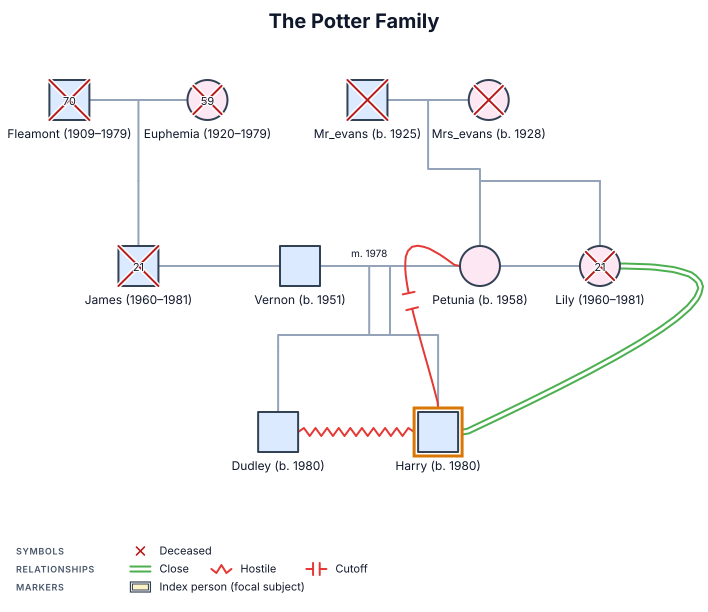

[Genogram syntax →](https://schematex.dev/docs/genogram)

---

### 🌐 Ecomap — *Hartman 1978 standard*

Family systems embedded in institutional, social, and cultural support networks. Radial layout, weighted connection strengths, directional energy flow.

```
ecomap "Nguyen Family Resettlement"
  center: family [label: "Nguyen Family"]
  resettlement [label: "IRC Office", category: government]
  school [label: "Lincoln Elementary", category: education]
  clinic [label: "Community Clinic", category: health]
  temple [label: "Vietnamese Temple", category: cultural]
  neighbors [label: "Sponsor Family", category: community]
  family === resettlement [label: "active case"]
  family === school
  clinic --> family [label: "vaccinations"]
  family === temple [label: "anchor"]
  neighbors === family [label: "housing host"]
```

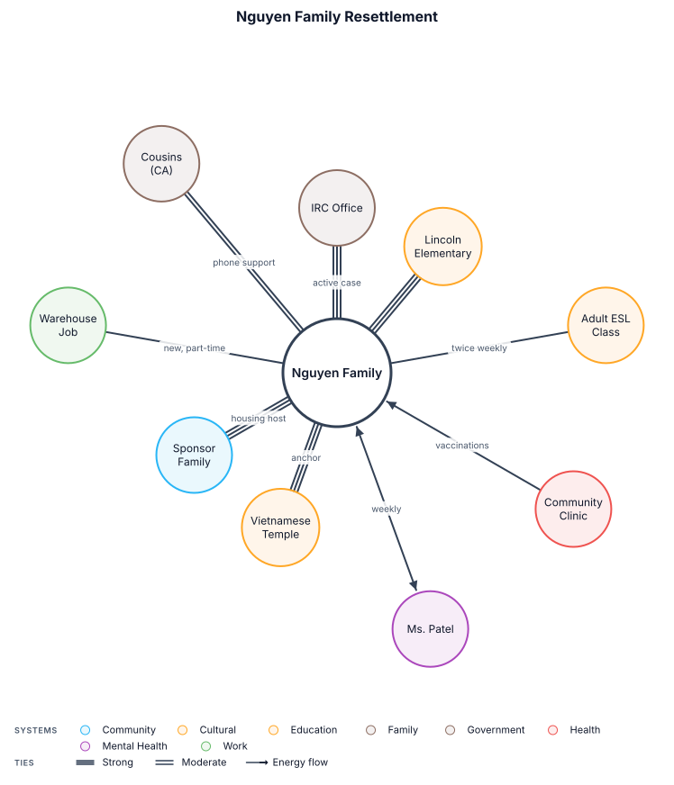

[Ecomap syntax →](https://schematex.dev/docs/ecomap)

---

### 🧬 Pedigree — *Standardized human pedigree nomenclature*

Multi-generation genetic inheritance charts for clinical genetics. Affected / carrier / presymptomatic status fills, proband arrow, consanguinity.

```
pedigree "BRCA1 Family — Hereditary Breast/Ovarian Cancer"
  I-1 [male, unaffected]
  I-2 [female, affected, deceased]
  I-1 -- I-2
    II-1 [female, affected]
    II-3 [female, carrier]
  II-1 -- II-4 [male, unaffected]
    III-1 [female, affected, proband]
    III-3 [female, presymptomatic]
```

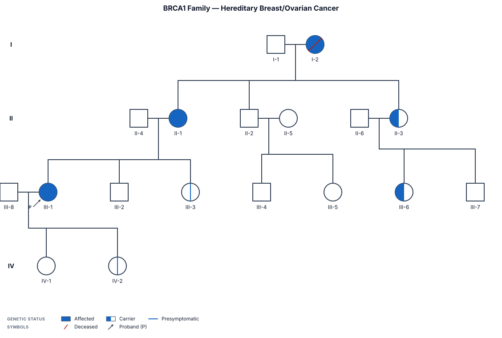

[Pedigree syntax →](https://schematex.dev/docs/pedigree)

---

### 🌿 Phylogenetic tree — *Newick + NHX*

Evolutionary trees with clade coloring, bootstrap support values, proportional branch lengths, and indent-based DSL alternative.

```
phylo "Bacterial Diversity"
  newick: "((((Ecoli:0.1,Salmonella:0.12):0.05[&&NHX:B=98],Vibrio:0.2):0.08,((Bacillus:0.15,Staph:0.18):0.06[&&NHX:B=92],Listeria:0.22):0.1):0.15,((Myco_tb:0.3,Myco_leprae:0.28):0.12[&&NHX:B=100],(Strepto:0.25,Lactobacillus:0.2):0.08):0.2);"
  clade Gamma = (Ecoli, Salmonella, Vibrio) [color: "#1E88E5", label: "γ-Proteobacteria"]
  clade Firmi = (Bacillus, Staph, Listeria) [color: "#E53935", label: "Firmicutes"]
  scale "substitutions/site"
```

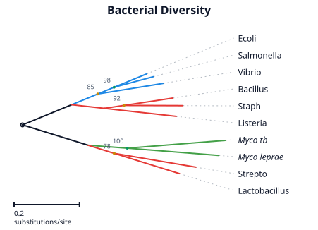

[Phylo syntax →](https://schematex.dev/docs/phylo)

---

### 🕸 Sociogram — *Moreno sociometry*

Social network diagrams with mutual choices, rejections, and group coloring. Force-directed or hierarchical layout. Auto-detects stars, isolates, cliques.

```
sociogram "Operation Sunset - Communication Network"
  config: layout = force-directed
  boss [label: "Subject Alpha"]
  lt1 [label: "Lieutenant 1"]
  lt2 [label: "Lieutenant 2"]
  courier1 [label: "Courier A"]
  courier2 [label: "Courier B"]
  contact1 [label: "External Contact 1"]
  contact2 [label: "External Contact 2"]
  associate1 [label: "Associate 1"]
  associate2 [label: "Associate 2"]
  boss <-> lt1 [weight: 4]
  boss <-> lt2 [weight: 4]
  lt1 -> courier1
  lt1 -> courier2
  lt2 -> associate1
  lt2 -> associate2
  courier1 -> contact1 [label: "supplier"]
  courier2 -> contact2 [label: "distributor"]
  lt1 <-> lt2 [weight: 2]
  associate1 -.- courier1
```

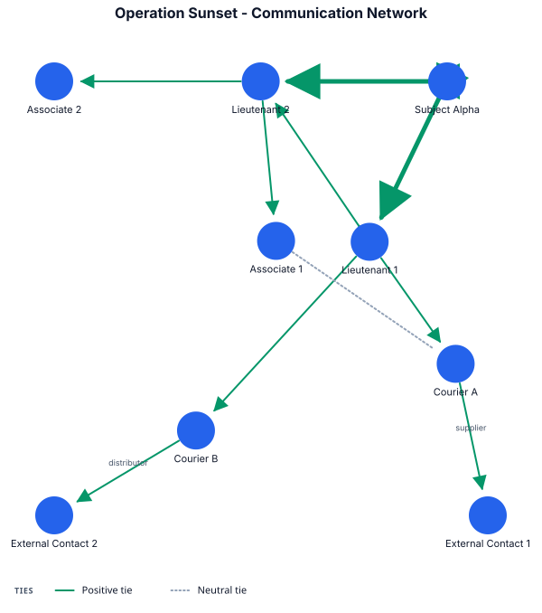

[Sociogram syntax →](https://schematex.dev/docs/sociogram)

---

### ⏱ Timing diagram — *WaveDrom-compatible*

Digital waveforms with clock pulses, bus segments, high-impedance, and group labels.

```
timing "SPI Transaction"
CLK:   pppppppp
CS_N:  10000001
MOSI:  x=======  data: ["0xAB","0xCD","0xEF","0x01","0x02","0x03","0x04","0x05"]
MISO:  zzzz====  data: ["","","","","0xFF","0x12","0x34","0x56"]
```

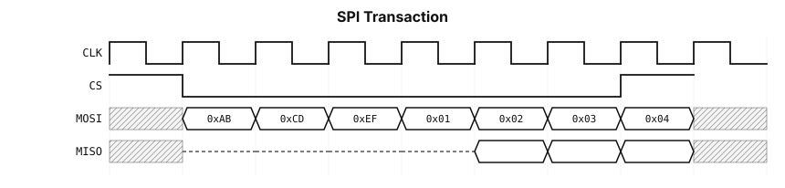

[Timing syntax →](https://schematex.dev/docs/timing)

---

### 🔌 Logic gate — *IEEE 91 & IEC 60617*

Combinational and sequential logic with automatic DAG layout and Manhattan wiring.

```
logic "1-bit Full Adder"
input A, B, Cin
output Sum, Cout
s1 = XOR(A, B)
Sum = XOR(s1, Cin)
c1 = AND(A, B)
c2 = AND(s1, Cin)
Cout = OR(c1, c2)
```

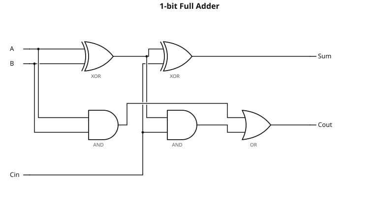

[Logic gate syntax →](https://schematex.dev/docs/logic)

---

### ⚡ Circuit schematic — *SPICE-style netlist or positional DSL*

Analog/digital circuits with auto-routed power/ground rails and orthogonal signal wiring.

```
circuit "CE Amp (netlist)" netlist
V1 vcc 0 9V
Rc vcc c 2.2k
Rb vcc b 100k
Q1 c b e npn
Re e 0 1k
```

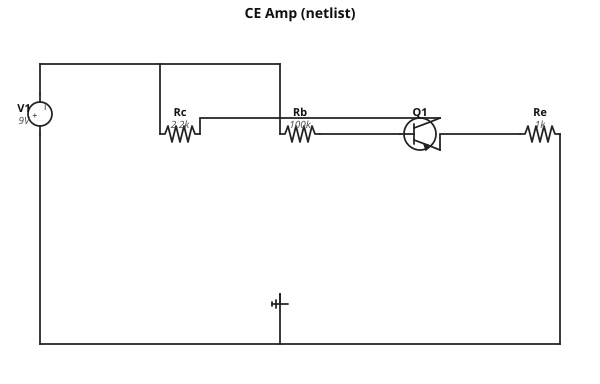

[Circuit syntax →](https://schematex.dev/docs/circuit)

---

### 🪜 Ladder logic — *IEC 61131-3 / Allen-Bradley*

Industrial PLC programs with tag+address+description labels, parallel branches, and Set/Reset coil pairs.

```
ladder "System Mode Selection"
rung 1 "Set Auto, reset Manual":
  XIC(AUTO_HMIPB, "BIT 5.10", name="Auto Mode HMI Pushbutton")
  XIO(MANL_HMIPB, "BIT 5.11", name="Manual Mode HMI Pushbutton")
  XIO(SYS_FAULT, "BIT 3.0", name="System Fault")
  parallel:
    branch: OTL(SYS_AUTO, "BIT 3.1", name="System Auto Mode")
    branch: OTU(SYS_MANUAL, "BIT 3.2", name="System Manual Mode")
```

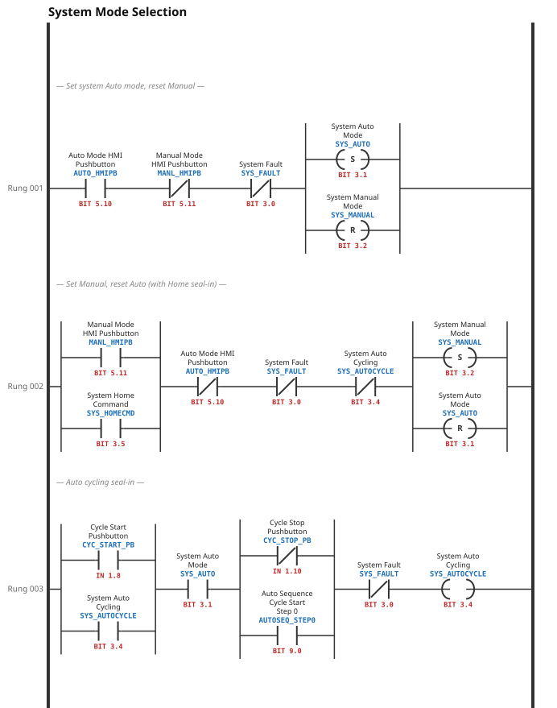

[Ladder syntax →](https://schematex.dev/docs/ladder)

---

### ⚡ Single-line diagram — *IEEE 315 power one-line*

Substation and distribution one-line diagrams with transformers, breakers, buses, and protective relays.

```
sld "Utility with generator backup"
UTIL = utility [voltage: "480V", label: "Utility"]
GEN = generator [rating: "500 kW", voltage: "480V", label: "Emergency Gen"]
ATS1 = ats [rating: "800A", label: "ATS-1"]
BUS1 = bus [voltage: "480V", label: "Critical Load Bus"]
CB1 = breaker [rating: "200A"]
CB2 = breaker [rating: "200A"]
L1 = load [rating: "100A", label: "Critical Load 1"]
L2 = load [rating: "100A", label: "Critical Load 2"]
UTIL -> ATS1
GEN -> ATS1
ATS1 -> BUS1
BUS1 -> CB1
BUS1 -> CB2
CB1 -> L1
CB2 -> L2
```

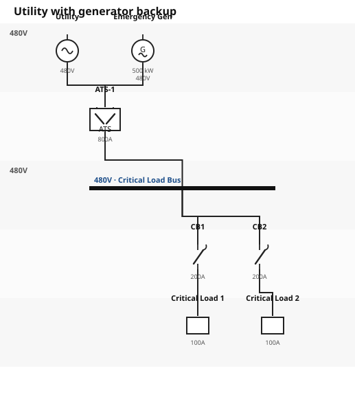

[SLD syntax →](https://schematex.dev/docs/sld)

---

### 🏢 Entity structure — *cap tables & corporate ownership*

Corporate parent/subsidiary structures with ownership percentages, jurisdiction clustering, and entity type shapes (C-corp, LLC, trust, fund).

```
entity "Acme Holdings"
  acme_inc [type: corp, jurisdiction: DE]
  acme_uk [type: ltd, jurisdiction: UK]
  acme_fund [type: fund, jurisdiction: KY]
  trust_a [type: trust, jurisdiction: SD]
  trust_a --100%--> acme_inc
  acme_inc --100%--> acme_uk
  acme_inc --60%--> acme_fund
```

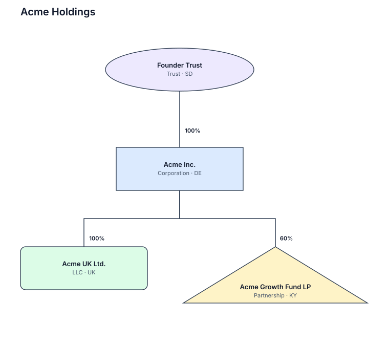

[Entity syntax →](https://schematex.dev/docs/entity)

---

### 📦 Block diagram

Signal-flow block diagrams with summing junctions, gain blocks, and feedback loops.

```
blockdiagram "Nested Feedback Loops"
G1 = block("G1(s)") [role: plant]
G2 = block("G2(s)") [role: plant]
G3 = block("G3(s)") [role: plant]
H1 = block("H1(s)") [role: sensor]
H2 = block("H2(s)") [role: sensor, route: above]
s1 = sum(+R, -h2)
s2 = sum(+a, -h1)
in -> s1 ["R(s)"]
s1 -> G1 -> s2
s2 -> G2 -> G3
G3 -> out ["Y(s)"]
G2 -> H1
H1 -> s2
G3 -> H2
H2 -> s1
```

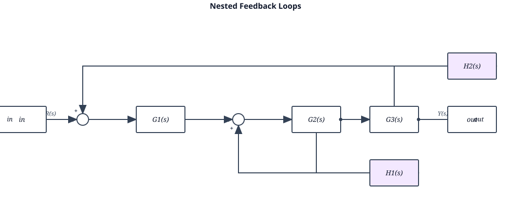

[Block syntax →](https://schematex.dev/docs/block)

---

### 🐟 Fishbone — *Ishikawa cause-and-effect*

Cause-and-effect diagrams with auto-categorized branches and alternating rib layout.

```
fishbone "Website Traffic Drop — Root Cause Analysis"
effect "Traffic Drop"
category content "Content"
category tech "Technical"
category links "Backlinks"
category ux "UX"
category competition "Competition"
category algo "Algorithm"
content : "Lower update frequency" : "Thin content" : "Keyword gaps"
tech : "Poor Core Web Vitals" : "WAF blocking crawlers"
links : "High-DA backlink loss" : "Referring domain plateau"
ux : "Bounce rate spike" : "Slow LCP" : "Intrusive interstitials"
competition : "New entrants" : "AI overviews displacing clicks"
algo : "Core Update penalty" : "Weak E-E-A-T signals" : "SGE traffic diversion"
```

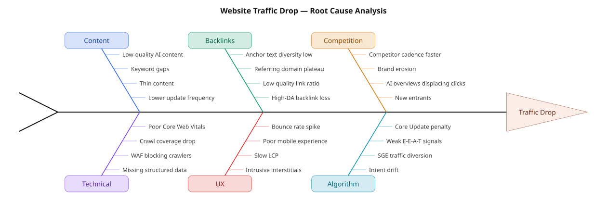

[Fishbone syntax →](https://schematex.dev/docs/fishbone)

### 🌳 Decision Tree — *Howard-Raiffa · CART/sklearn · Taxonomy*

Three modes in one DSL. Decision analysis with EV rollback (Howard-Raiffa), ML tree visualization (sklearn `plot_tree` style), and yes/no taxonomy trees. Diagonal edge routing, payoff-aligned columns, optimal-path highlighting.

**Decision analysis — EV rollback:**
```
decisiontree:decision "Oil drilling"

decision "Drill or sell rights?"
  choice "Sell rights"
    end payoff=90000 "Guaranteed sale"
  choice "Drill"
    chance "Well outcome"
      prob 0.3 end payoff=500000 "Major strike"
      prob 0.5 end payoff=50000  "Minor strike"
      prob 0.2 end payoff=-200000 "Dry hole"
```

**ML tree — sklearn CART style:**
```
decisiontree:ml "Iris classification"
classes: setosa, versicolor, virginica
impurity: gini
branchLabels: relation

split feature=petal_width op=<= threshold=0.8 samples=120 value=[50,35,35] gini=0.66
  true leaf samples=50 value=[50,0,0] gini=0 class=setosa
  false split feature=petal_width op=<= threshold=1.75 samples=70 value=[0,35,35] gini=0.5
    true leaf samples=36 value=[0,32,4] gini=0.198 class=versicolor
    false leaf samples=34 value=[0,3,31] gini=0.162 class=virginica
```

**Taxonomy — yes/no classification:**
```
decisiontree:taxonomy "ED Triage Level"
direction: left-right

q "Airway compromise?"
  yes: a "Level 1 — Resuscitation"
  no: q "Vital signs unstable?"
    yes: a "Level 2 — Emergent"
    no: q "Multiple resources needed?"
      yes: a "Level 3 — Urgent"
      no: a "Level 4/5 — Less urgent"
```

[Decision Tree syntax →](https://schematex.dev/docs/decisiontree)

---

### 📅 Timeline

Historical events, biographical lifelines, product roadmaps, and geological timescales on a proportional / equidistant / log axis. Three visual styles: **swimlane** (multi-track biographies), **gantt** (project plan with pins + category lanes + legend), and **lollipop** (alternating above/below cards on a center axis). Supports BC/AD dates, quarter dates (`2026-Q1`), and geological mega-year (`Ma`) scale.

```
timeline "Apollo program"

1961-05-25: milestone "Kennedy Moon speech"
1967-01-27: "Apollo 1 fire"
1968-12-21 - 1968-12-27: "Apollo 8 — first lunar orbit"
1969-07-16 - 1969-07-24: "Apollo 11 — Moon landing" [icon:🚀]
1970-04-11 - 1970-04-17: "Apollo 13 — abort"
1972-12-07 - 1972-12-19: "Apollo 17 — last crewed Moon mission"
```

```
timeline "Brand story"
config: style = lollipop

era 2015 - 2019: "Scrappy startup"
era 2019 - 2023: "Scale-up"
era 2023 - 2027: "Enterprise era"

2015: "Founded in a coffee shop" [icon:☕]
2017: milestone "First 1000 users" [icon:👥]
2019: "Series A" [icon:💰]
2021: "Opened NYC office" [icon:🏙]
2023: milestone "Crossed $50M ARR" [icon:📊]
2025: "Acquired Acme Inc." [icon:🤝]
```

```
timeline "Q2 Launch plan"
config: style = gantt

2026-04-01: milestone "Kickoff"
2026-06-30: milestone "GA launch" [icon:🚀]

2026-04-01 - 2026-04-30: "Research & specs" [category: "Design"]
2026-04-10 - 2026-06-10: "API build" [category: "Eng"]
2026-05-15 - 2026-06-25: "Campaign prep" [category: "Marketing"]
```

[Timeline syntax →](https://schematex.dev/docs/timeline)

### 🗓️ PERT / CPM — *PMI PMBOK 7 activity-on-node network*

The only text-DSL PERT tool that **computes the schedule**. You write tasks, durations, and dependencies — the engine runs the forward and backward pass and returns Early/Late Start & Finish, total slack, project duration, and the critical path (highlighted in red). Supports FS/SS/FF/SF dependencies with lag/lead, three-point estimation (`te + variance`), milestones, swimlanes (`lane:`), and a time-scaled layout.

```
pert
title: "Q3 Product Launch"
unit: days

task A "Market research"      duration: 5
task B "Design mockups"       duration: 8  after: A
task C "Backend API"          duration: 15 after: A
task D "Frontend build"       duration: 10 after: B, C
task E "QA / testing"         duration: 5  after: D
task F "Marketing collateral" duration: 7  after: B
task G "Launch event"         duration: 2  after: E, F
```

[PERT / CPM syntax →](https://schematex.dev/docs/pert)

#### …and as a Gantt chart — *the one that computes its own critical path*

Start with the `gantt` header (sugar for `pert` + `layout: gantt`). Same scheduler — so the bars are placed from the **computed** ES/EF and the **critical path is drawn in red**, which a hand-placed Gantt (Mermaid) can't do: there you type the dates, here you type dependencies. Calendar date axis (`start:` + `calendar: continuous|5day`), sections (`lane:`), progress overlays (`progress:`), milestones, and a `today:` marker.

```
gantt "Website Relaunch"
start: 2026-07-01
calendar: 5day
task A "Discovery"      duration: 5  lane: "Plan"
task B "Wireframes"     duration: 8  after: A   lane: "Design"
task C "Visual design"  duration: 6  after: B   lane: "Design"  progress: 40%
task D "Frontend build" duration: 12 after: C   lane: "Build"
task E "Backend API"    duration: 10 after: A   lane: "Build"
task F "Integration"    duration: 5  after: D, E lane: "Build"
task LAUNCH "Go live"   milestone    after: F   lane: "Build"
```

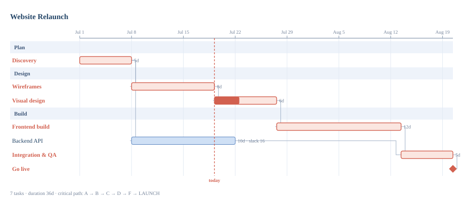

---

### ◉ Petri net — *Murata 1989 / ISO-IEC 15909 place-transition net*

The only text-DSL Petri net tool that **understands the dynamics**, not just the shapes. You declare places (circles holding tokens), transitions (bars), and weighted arcs; the engine validates the bipartite structure, computes which transitions are *enabled* under the marking (highlighted green), and can `fire:` a sequence forward to render any reachable marking. Immediate vs. timed transitions, arc weights, capacity, and inhibitor / read / reset arcs — the recognised concurrency vocabulary.

```
petri "Mutual Exclusion — two processes, one resource"
  place idleA *1 "A idle"
  place idleB *1 "B idle"
  place mutex *1 "resource"
  place critA "A critical"
  place critB "B critical"
  transition enterA
  transition exitA
  transition enterB
  transition exitB
  idleA -> enterA
  mutex -> enterA
  enterA -> critA
  critA -> exitA
  exitA -> idleA
  exitA -> mutex
  idleB -> enterB
  mutex -> enterB
  enterB -> critB
  critB -> exitB
  exitB -> idleB
  exitB -> mutex
```

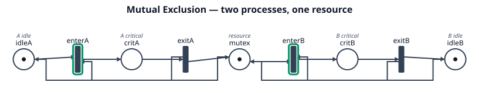

[Petri net syntax →](https://schematex.dev/docs/petri)

---

### 🖧 Network topology — *Cisco-convention icons · device / link / port integrity*

The free, text-first, zero-dependency network-diagram engine. Declare typed devices (router, switch, firewall, AP, server, **IP camera / NVR / PoE switch**, …) and typed annotated links (copper / fiber / wireless / serial / **PoE** / VPN / LAG, carrying VLAN / speed / port / mode), group them into sites, racks, subnets and VLANs, and let the engine lay out the topology class correctly — `tiered` (three-tier campus), `star`, `ring`, `bus`, `mesh`, `spine-leaf` (auto-meshed Clos), or `tree`. Unlike an LLM emitting raw Mermaid, it **never drops a device, a port, or a link**, and it validates IP-in-subnet and VLAN ranges.

```
network "Acme HQ — CCTV"
  layout: tiered
  internet net "Internet"
  firewall fw1 "Perimeter FW" tier: edge
  l3switch core1 "Core SW" tier: core
  poeswitch poe1 "PoE Switch A" tier: access
  poeswitch poe2 "PoE Switch B" tier: access
  nvr nvr1 "Video Recorder"
  monitor wall1 "Guard Station"
  subnet cams "192.168.20.0/24" {
    camera cam1 "Lobby Dome" type: dome ip: 192.168.20.11
    camera cam2 "Gate PTZ" type: ptz ip: 192.168.20.12
    camera cam3 "Dock Bullet" type: bullet ip: 192.168.20.13
    poe1
    poe2
  }
  net -- fw1 : wan "ISP 1Gbps"
  fw1 -- core1 : fiber 10G
  core1 -- poe1 : trunk vlan: 20 1G
  core1 -- poe2 : trunk vlan: 20 1G
  core1 -- nvr1 : 1G
  core1 -- wall1
  poe1 -- cam1 : poe
  poe1 -- cam2 : poe
  poe2 -- cam3 : poe
```

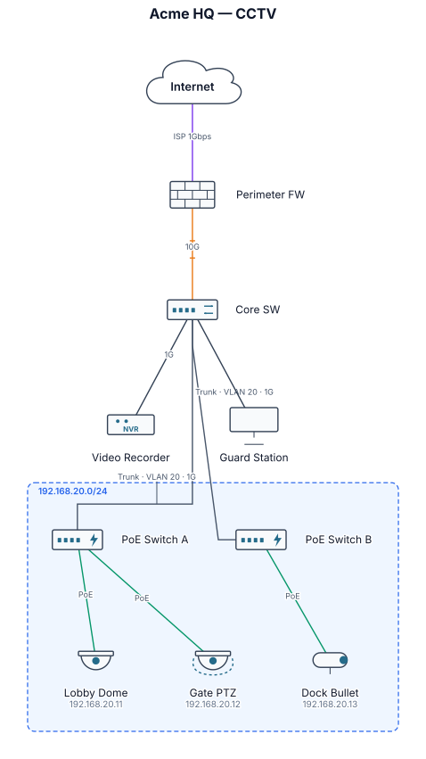

[Network topology syntax →](https://schematex.dev/docs/network)

---

### 📐 UML class diagram — *UML 2.5.1 §9–§11*

Classifiers (class / interface / enum / datatype / primitive), all six relationship kinds with standard-correct adornments, and a **generalization-driven layered layout** where parents float to the top and connectors never cross a box. Namespaces render as nested containment frames. Accepts the Mermaid `classDiagram` glyphs for one-line migration.

```
umlclass
title: "Shape hierarchy"

«interface» Shape {
  + area() : double
  + perimeter() : double
}

abstract class AbstractShape {
  # name : String
  + area() : double {abstract}
  + perimeter() : double {abstract}
  + describe() : String
}

class Circle {
  + radius : double
  + area() : double
}

class Square {
  + side : double
  + area() : double
}

Shape         <|.. AbstractShape
AbstractShape <|-- Circle
AbstractShape <|-- Square
```

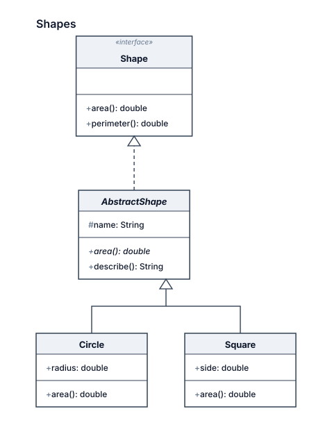

[UML class syntax →](https://schematex.dev/docs/umlclass)

---

### 🛡️ Fault tree — *NUREG-0492 / IEC 61025 · MOCUS*

Reliability fault trees where the engine **computes the answer**: it runs MOCUS to enumerate the minimal cut sets (red boxes), flags single points of failure, and computes the top-event probability. AND domes, OR/XOR shields, k-of-n voting, INHIBIT, PAND.

```
faulttree "Both pumps fail"
  analysis: cutsets, probability
  top T "Both redundant pumps fail" = AND(PA, PB)
  basic PA "Pump A fails" p: 0.01
  basic PB "Pump B fails" p: 0.01
```

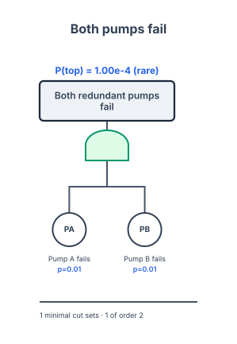

[Fault tree syntax →](https://schematex.dev/docs/faulttree)

---

### 🎀 Bowtie — *CCPS / Energy Institute 2018 barrier model*

Barrier-based risk management for one major-accident scenario: threats fan in through preventative-barrier chains (left), consequences fan out through mitigative chains (right), around a central top-event knot. **Correct by construction** — a threat or consequence drawn with no barrier is rejected, not silently shown.

```
bowtie "LPG storage — loss of containment"
hazard "LPG stored under pressure"
topevent "Loss of containment"
threat "Corrosion of vessel wall"
  prevent "Corrosion-resistant coating"
  prevent "UT thickness inspection"
threat "Overpressure during filling"
  prevent "High-pressure trip (SIL 2)"
  prevent "Pressure relief valve"
consequence "Jet fire"
  mitigate "Gas detection + ESD"
  mitigate "Deluge / water spray"
consequence "Vapour cloud explosion"
  mitigate "Ignition-source control (ATEX)"
  mitigate "Blast-resistant control room"
```

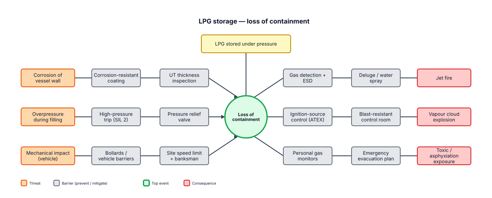

[Bowtie syntax →](https://schematex.dev/docs/bowtie)

---

### 🧱 Reliability block diagram — *IEC 61078 · success logic*

Model whether a system *works* from its components' reliabilities — and the engine **computes the answer**: it reduces the success logic (∏ for series, 1−∏(1−Rᵢ) for parallel, exact k-of-n) to the **system reliability**, derives each block's **Birnbaum importance**, and flags **single points of failure** in red. The success-space dual of the fault tree.

```
rbd "Redundant Server"
  series {
    block PSU "Power Supply" R=0.99
    parallel {
      block FAN1 "Fan A" R=0.95
      block FAN2 "Fan B" R=0.95
    }
    kofn 2/3 {
      block D1 "Disk 1" R=0.97
      block D2 "Disk 2" R=0.97
      block D3 "Disk 3" R=0.97
    }
  }
```

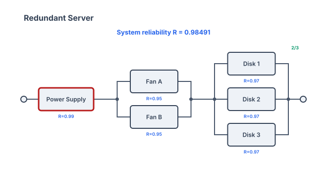

[RBD syntax →](https://schematex.dev/docs/rbd)

### 🏠 Floor plan — *Architectural Graphic Standards plan view*

Rooms with real dimensions become poché walls with automatic shared-wall merging; doors get standard swing arcs, windows get glazing lines, and a 93-symbol furniture catalog — residential, kitchen/bath, classroom/office, event/banquet, retail/warehouse, salon/gym, and site/outdoor (`tree`, `car`) — auto-seats its tables (a `round-table-8` *is* 8 countable chairs). L/T/U-shaped rooms via `extend`, stairs with the UP arrow + cut-plane break line, and validation that catches what LLMs actually get wrong — overlapping rooms, doors on non-shared walls, colliding furniture (chair-ring envelopes included).

```
floorplan "Two-Bedroom Apartment — 68 m²" unit m
room living  "Living Room"  at 0,0          size 5.2x4.2
room kitchen "Kitchen"      right-of living size 3.0x4.2
room hall    "Hallway"      below living    size 2.0x2.6
door hall west at 50% width 1.0
opening between living kitchen at 35% width 1.2
door between hall living at 50%
window living north at 30% width 1.8
furniture sofa in living at 0.25,2.9
furniture dining-table in kitchen at 0.5,1.7 size 1.5x0.9
```

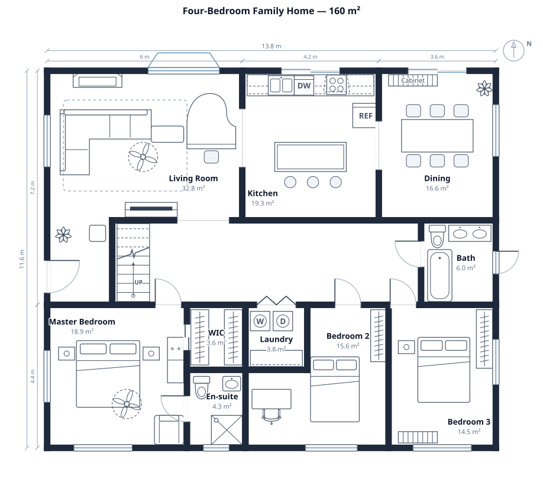

[Floor plan syntax →](https://schematex.dev/docs/floorplan)

### 🏟️ Sports playbook — *coaching X&O notation, three sports*

One paragraph of text becomes a coach's tactics board — for **American football**, **basketball**, or **soccer**. Name a `sport` and a `formation` and the engine places the players; add movement verbs (`route`, `pass`, `cut`, `dribble`, `run`, `screen`, `shot`) and each is drawn in that sport's own coaching-correct line style on its own correctly-scaled field, court, or pitch. Football routes follow the numbered route tree on a yard-scaled field with hashes, end zone, and goalposts; basketball uses named landmarks (rim, elbow, wing) on an NBA half-court drawn on hardwood; soccer plays out on a full IFAB pitch. The pass-vs-run line convention is *inverted* between sports — basketball draws a pass dashed and a cut solid, soccer draws a pass solid and a run dashed — and Schematex honours each, with the legend matching the sport.

```
playbook "Spread Pick & Roll" sport basketball
set spread-pnr
screen 5 1
dribble 1 to 11,17
cut 5 rim
pass 1 2
```

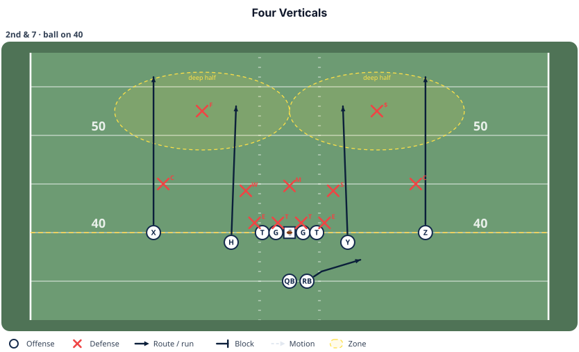
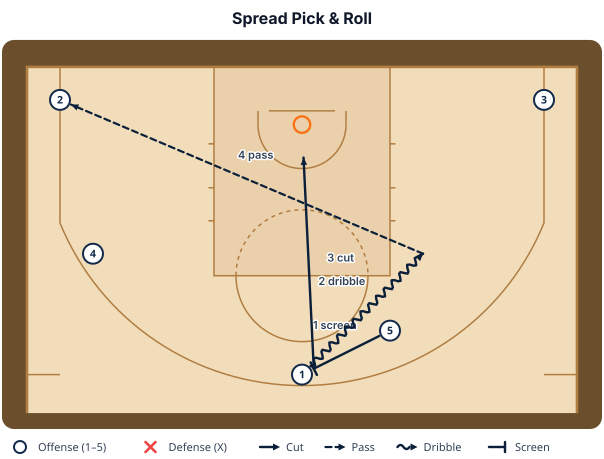
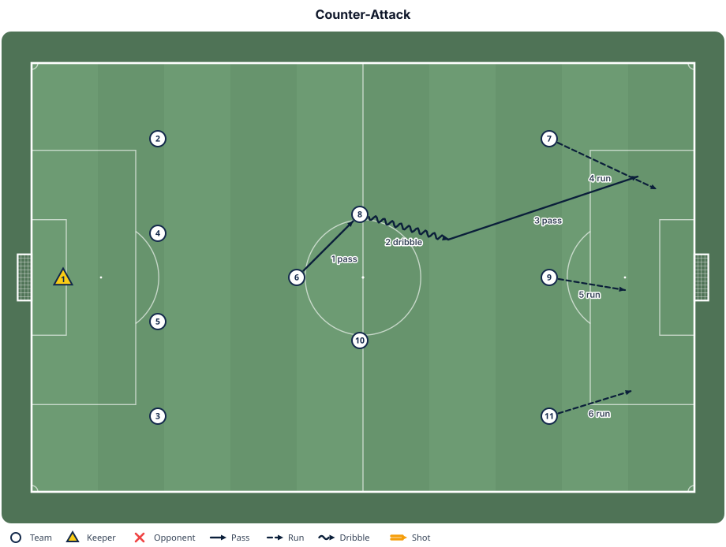

[Sports playbook syntax →](https://schematex.dev/docs/playbook)

## Why SchemaTex?

**Generic flowchart tools can't draw professional diagrams.** Every diagram domain has published standards — symbol conventions, layout rules, labelling grammars — and when you ignore them, domain experts reject the output:

- **Genograms** follow the [McGoldrick (2020)](https://en.wikipedia.org/wiki/Genogram) standard — gender-specific shapes, medical condition fill patterns, emotional-relationship line styles, generation-based layout. A circle-labeled-as-female in a flowchart is not a genogram.
- **Ladder logic** follows [IEC 61131-3](https://en.wikipedia.org/wiki/IEC_61131-3) with Allen-Bradley tag conventions — three-line labels (tag/address/description), Set/Reset coils, input-side seal-in, parallel rungs.
- **Single-line diagrams** follow [IEEE 315](https://standards.ieee.org/ieee/315/5052/) — protective device clustering, voltage-tier hierarchy, transformer symbology.
- **Pedigrees** follow NSGC human-pedigree nomenclature; **phylogenetic trees** roundtrip Newick + NHX; **cap tables** compute tier-aware ownership rollup.

SchemaTex treats each standard as a first-class citizen with its own parser, layout algorithm, and SVG renderer — **standards-as-code**, not generic shapes with domain labels.

No existing open-source library covers this spread. GoJS has isolated samples but costs **$7k+/seat**. Schemdraw is Python-only. draw.io is a heavyweight GUI. Everything else is proprietary or abandoned.

### Designed for LLM code generation

SchemaTex DSLs are small, consistent, and shaped by what LLMs get wrong:

- Each diagram type has a minimal, documented grammar an LLM can learn from a single example.
- Error messages are AI-readable — line number plus specific fix suggestion, not `Parse error at line 42`.
- Syntax avoids the common LLM failure modes (CJK quoting, ambiguous nesting, positional vs. named args).

Written by humans, shaped by what LLMs get wrong.

## Features

- **Zero runtime dependencies.** No D3, no dagre, no parser generators. Hand-written parsers and layout engines. Self-contained TypeScript.
- **Standards-compliant output.** Each diagram type implements a published specification, not our own invention.
- **Semantic SVG.** Every element has accessible `<title>` / `<desc>`, CSS classes for theming, and `data-*` attributes for interactivity. No inline styles.
- **Tree-shakable plugin architecture.** Each diagram is an independent plugin with its own parser, layout, and renderer. `schematex/genogram` → ~30 KB.
- **SSR-ready.** Pure string output, no DOM required. Works in Node, edge runtimes, and browsers.
- **TypeScript strict.** No `any`, no un-typed escape hatches.

## API

```ts
// Universal entry — auto-detects diagram type from first keyword
import { render, renderPreview, renderResult, parse, parseResult } from 'schematex';

const svg = render(text, config?);              // strict → SVG string or throw
const ast = parse(text, config?);               // strict → AST or throw
const previewSvg = renderPreview(text, config?); // always → SVG, including a visible diagnostic fallback
const renderState = renderResult(text, config?); // → SVG + diagnostics + valid/partial/invalid status
const parseState = parseResult(text, config?);   // → AST or diagnostics without throwing

// Per-diagram tree-shaking
import { render } from 'schematex/genogram';

// Browser DOM
import {
  renderToElement,
  renderToContainer,
  renderPreviewToElement,
  renderPreviewToContainer,
} from 'schematex/browser';
container.appendChild(renderToElement(dsl));

// React
import { SchematexDiagram } from 'schematex/react';
// <SchematexDiagram dsl="genogram ..." theme="monochrome" />

// Export (browser Canvas)
import { svgToPngBlob, downloadBlob, printSvgAsPdf } from 'schematex/export';
const blob = await svgToPngBlob(svg, { scale: 2 });           // transparent PNG
const opaque = await svgToPngBlob(svg, { background: 'white' }); // opt-in fill
downloadBlob(blob, 'diagram.png');
```

See the [API reference →](https://schematex.dev/docs/api).

### Backgrounds & dark mode

Schematex SVGs are **background-agnostic by default** — no fill is baked into the
output, so a diagram inherits whatever color its host element provides. This
keeps the same SVG embeddable in light pages, dark canvases, or print PDFs.

When using `theme: "dark"`, the diagram's strokes and text are designed for a
dark surface — wrap the SVG in a container with a dark background, e.g.:

```html
<div style="background: #0f172a; padding: 16px;">
  <!-- schematex SVG with theme: "dark" -->
</div>
```

PNG export (`svgToPngBlob`) defaults to a transparent background. Pass
`background: 'white'` (or any color) to bake one in.

## Ecosystem

- **React** — `schematex/react` — `<SchematexDiagram dsl="..." />` component
- **Browser** — `schematex/browser` — `renderToElement()` / `renderToContainer()`
- **Export** — `schematex/export` — PNG (@2×) + print-to-PDF via browser Canvas
- **Obsidian** — code-block renderer plugin *(coming soon)*
- **Markdown-it / remark** — diagram fence support *(coming soon)*
- **CLI** — `npx schematex input.txt > output.svg` *(coming soon)*

## Contributing

Contributions welcome. See [CONTRIBUTING.md](./CONTRIBUTING.md).

Adding a new diagram type follows a 5-file pattern (parser, symbols, layout, renderer, integration). Each type has a standards document in [`docs/reference/`](./docs/reference/).

```bash
npm install
npm run typecheck
npm run test
npm run build
```

## License

[AGPL-3.0](./LICENSE) for open-source use. For commercial use without AGPL obligations (embedding SchemaTex into proprietary or closed-source products), a commercial license is available — contact **victor@mymap.ai**.

<p align="center"><sub>Built by <a href="https://mymap.ai">MyMap.ai</a>.</sub></p>
